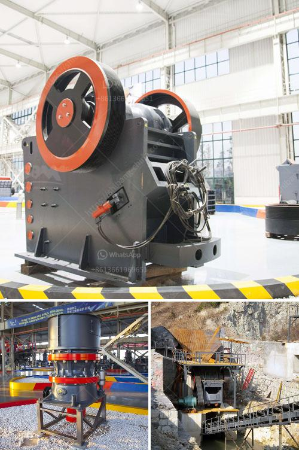

<h3>gravel making equipment</h3>
Gravel is a crucial component in various construction projects, such as roadworks, landscaping, and building foundations. To meet the growing demand for this versatile material, the gravel making industry relies heavily on efficient equipment. From crushers to screens and conveyors, gravel making equipment plays a vital role in producing high-quality gravel efficiently.

One of the primary pieces of equipment in gravel making is the crusher. A crusher breaks down large rocks and stones into smaller pieces, making it easier to transport and handle. There are several types of crushers commonly used in the gravel making industry, such as jaw crushers, impact crushers, and cone crushers.

Jaw crushers are ideal for primary crushing operations, as they can handle large rocks and stones. They consist of a fixed jaw plate and a movable jaw plate, which create a v-shaped cavity where the rocks are crushed. The crushed material then falls down through the bottom opening, ready for further processing.

Impact crushers, on the other hand, are suitable for secondary crushing. They use high-speed impact forces to break down the rocks and create smaller particles. Impact crushers can be either horizontal or vertical shaft impactors, depending on the orientation of the rotor.

Cone crushers, often used in tertiary crushing, have a cone-shaped crushing chamber that operates similar to a gyratory crusher. The material is fed into the chamber through the top and crushed between the mantle and the concave. Cone crushers produce finer gravel particles compared to jaw and impact crushers, making them ideal for specific applications.

Once the rocks are crushed to the desired size, they are then sorted using screens. Screens are used to separate the gravel into different sizes, ensuring that each size meets the specific requirements of the project. Vibrating screens are commonly used in gravel making operations. These screens have multiple layers of mesh, allowing the separation of various sizes of gravel.

Conveyors play a crucial role in transporting gravel from the crusher to the sorting screens. They ensure a continuous flow of material, improving productivity and efficiency. Belt conveyors are commonly used in gravel making operations, as they can handle bulk materials and long distances. They are highly customizable, allowing the design to fit the specific needs of the operation.

In recent years, advancements in technology have improved the efficiency and productivity of gravel making equipment. Automation, remote monitoring, and advanced control systems enable operators to optimize the performance of the equipment, reducing downtime and increasing output.

Furthermore, environmental considerations have also influenced the design of gravel making equipment. Dust control systems are now a standard feature in many crushers and screening plants, minimizing the impact on air quality. Water sprays and polymer coatings are used to control dust emissions, ensuring a safer and cleaner working environment.

In conclusion, gravel making equipment plays a critical role in meeting the demand for high-quality gravel. Crushers, screens, and conveyors are the primary tools used in the gravel making industry. Technological advancements have improved their efficiency and productivity, while also addressing environmental concerns. As construction and infrastructure projects continue to grow, the gravel making industry will remain an essential part of the construction sector.
<h3>Contact us</h3><ul><li><strong>Whatsapp:&nbsp;<a href="https://wa.me/8613661969651">+8613661969651</a></strong></li><li><a href="https://swt.shibang-china.com/?git&amp;zhl&amp;gravel making equipment"><strong>Online Service(chat now)</strong></a></li></ul><h3>Related</h3><ul><li><a href='how is calcite used to manufacture paper.md'>how is calcite used to manufacture paper</a></li><li><a href='cement process plant crushing machines manufacturer.md'>cement process plant crushing machines manufacturer</a></li><li><a href='16 mesh silica sand crusher.md'>16 mesh silica sand crusher</a></li><li><a href='iron mining crusher.md'>iron mining crusher</a></li><li><a href='price of ceramic making machine in india.md'>price of ceramic making machine in india</a></li></ul>