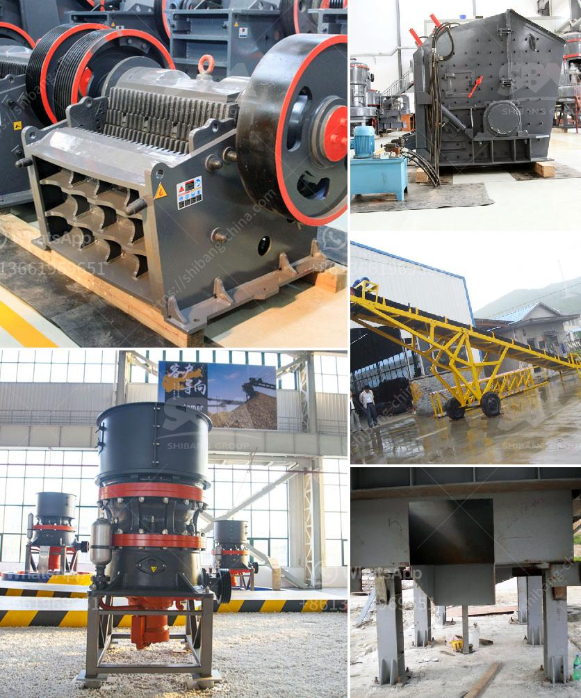

<h3>gravel manufacturing company in thiruvallur district</h3>
Thiruvallur district, located in the northern part of Tamil Nadu, India, is witnessing rapid growth and development in the construction sector. A key contributor to this growth is the emergence of gravel manufacturing companies. These enterprises play a pivotal role in supplying high-quality gravel and other construction materials, fostering sustainable infrastructure development, and boosting the local economy. This article explores the impact of gravel manufacturing companies in Thiruvallur district, shedding light on their role, benefits, and prospects for the future.

Gravel manufacturing companies primarily specialize in the extraction, crushing, and refining of natural aggregates, such as gravel, sand, and crushed stones. They obtain these materials from local quarries, employ advanced machinery and processing techniques to produce various sizes and types of aggregates used in construction projects. The gravel produced by these companies serves as an essential ingredient in the production of concrete, asphalt, road base, and other construction materials.

The presence of gravel manufacturing companies in Thiruvallur district has significantly boosted the construction industry. These companies ensure a steady supply of high-quality aggregates to meet the growing demand for construction projects, including roads, bridges, buildings, and infrastructure. By providing consistent and reliable access to materials, they reduce construction delays, enhance project management efficiency, and contribute to cost-effective construction practices.

Moreover, the availability of locally produced gravel contributes to the sustainability of infrastructure development. It reduces transportation costs, carbon emissions caused by long-distance material hauling, and environmental degradation associated with excessive extraction from distant locations. These factors benefit both the construction industry and the environment, making gravel manufacturing an environmentally-friendly choice.

Gravel manufacturing companies in Thiruvallur district have not only revolutionized construction techniques but have also become significant contributors to the local economy. These enterprises generate employment opportunities for local residents, ranging from skilled labor to managerial positions. By creating jobs and stimulating economic growth, they enhance the overall standard of living in the district.

Furthermore, gravel manufacturing companies often engage in corporate social responsibility initiatives, supporting the local community through infrastructure development, educational programs, healthcare facilities, and improved public amenities. These socioeconomic contributions strengthen the bond between the companies and the community, fostering a mutually beneficial relationship.

The future prospects for gravel manufacturing companies in Thiruvallur district seem promising. As the construction industry continues to expand, the demand for aggregates is likely to increase. To meet this demand, companies are expected to invest in advanced technologies, improved processing techniques, and sustainable extraction practices. This will further enhance the quality of aggregates produced, reduce environmental impacts, and optimize operations.

Additionally, the use of recycled aggregates, produced from the demolition and recycling of construction waste, is gaining momentum. Gravel manufacturing companies can capitalize on this trend by implementing recycling facilities and promoting the use of recycled aggregates, fostering a more circular and sustainable construction industry.

Gravel manufacturing companies in Thiruvallur district have emerged as key players in transforming construction practices, ensuring a steady supply of high-quality aggregates, fostering sustainable infrastructure development, and boosting the local economy. Their contributions to employment generation, economic development, and environmental conservation are commendable. As the construction industry continues to grow, these companies are expected to play an even more significant role, embracing technological advancements and sustainable practices to shape the future of construction in the district and beyond.
<h3>Contact us</h3><ul><li><strong>Whatsapp:&nbsp;<a href="https://wa.me/8613661969651">+8613661969651</a></strong></li><li><a href="https://swt.shibang-china.com/?git&amp;zhl&amp;gravel manufacturing company in thiruvallur district"><strong>Online Service(chat now)</strong></a></li></ul><h3>Related</h3><ul><li><a href='jaw crusher machine in dubai.md'>jaw crusher machine in dubai</a></li><li><a href='vertical shaft impact crusher.md'>vertical shaft impact crusher</a></li><li><a href='how to ball mill magnesium.md'>how to ball mill magnesium</a></li><li><a href='difference between primary and secondary jaw crusher.md'>difference between primary and secondary jaw crusher</a></li><li><a href='crusher processing machines nigeria.md'>crusher processing machines nigeria</a></li></ul>