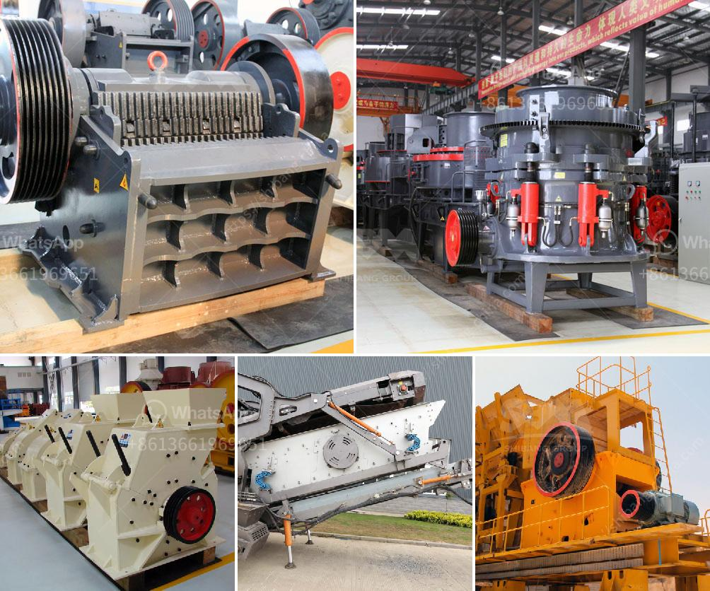

<h3>gravel washing plant for sale in uk</h3>
Are you in the construction or mining industry in the UK and in need of a reliable gravel washing plant? Look no further! We have the perfect solution for you - a quality gravel washing plant available for sale right here in the UK.

Gravel is an essential material used in various construction projects, from roadways and building foundations to landscaping and drainage systems. However, before it can be used, gravel often needs to be cleaned and washed to remove impurities such as dirt, silt, and debris. This is where a gravel washing plant comes into play.

Our gravel washing plant is designed to efficiently and effectively clean and separate gravel particles, ensuring that you receive high-quality, clean gravel for your projects. It is equipped with state-of-the-art technology and features that make it a reliable and efficient solution.

With a processing capacity of up to [insert capacity], our gravel washing plant can handle large volumes of gravel, allowing you to meet the demands of your projects. It has a robust construction, designed to withstand the harsh conditions of the industry, ensuring durability and longevity.

Furthermore, our gravel washing plant offers the convenience of easy operation and maintenance. It incorporates user-friendly controls and comes with detailed documentation, making it simple to operate. Regular maintenance and servicing are also straightforward, ensuring minimal downtime and maximum productivity.

Purchasing a gravel washing plant in the UK means that you can avoid the hassle and cost of importing machinery from abroad. You can also benefit from our reputable customer support and after-sales services, ensuring that you have ongoing assistance throughout the lifespan of your plant.

So, if you are in need of a reliable gravel washing plant in the UK, look no further! Contact us today to explore our range of options and find the perfect solution to meet your requirements.
<h3>Contact us</h3><ul><li><strong>Whatsapp:&nbsp;<a href="https://wa.me/8613661969651">+8613661969651</a></strong></li><li><a href="https://swt.shibang-china.com/?git&amp;zhl&amp;gravel washing plant for sale in uk"><strong>Online Service(chat now)</strong></a></li></ul><h3>Related</h3><ul><li><a href='jaw crusher specification for activated carbon.md'>jaw crusher specification for activated carbon</a></li><li><a href='sand washing plant south africa.md'>sand washing plant south africa</a></li><li><a href='jaw crusher in germany used.md'>jaw crusher in germany used</a></li><li><a href='ore crusher mining equipment business plan.md'>ore crusher mining equipment business plan</a></li><li><a href='ball mill liners manufacturers.md'>ball mill liners manufacturers</a></li></ul>