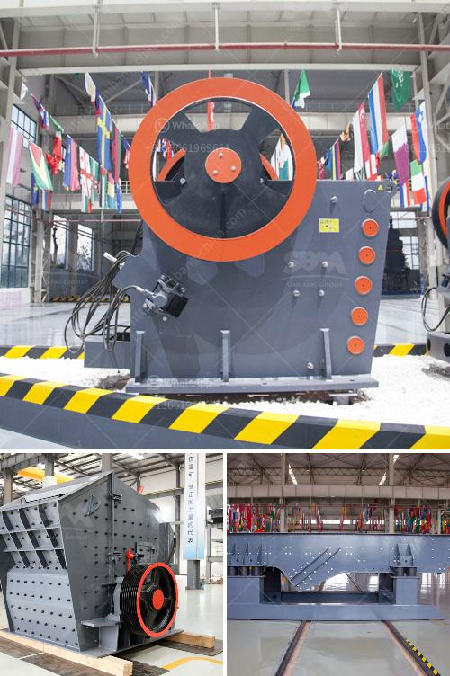

<h3>griding machine zenith</h3>
Grinding machines are widely used in various industries for shaping, honing, and finishing workpieces. Among the many manufacturers in the market, Zenith has established a reputation for producing high-quality and reliable grinding machines. The Zenith grinding machine is a versatile tool that offers superior precision, efficiency, and durability, making it a must-have for any workshop or industrial setting.

One of the standout features of the Zenith grinding machine is its precision engineering, which ensures consistent and accurate results. The machine is equipped with advanced technology that allows for micro-adjustments and precise control over the grinding process. This level of precision is crucial for industries that require a high degree of accuracy, such as automotive, aerospace, and medical device manufacturing.

The Zenith grinding machine also boasts remarkable efficiency in terms of speed and productivity. Its powerful motor allows for rapid material removal, reducing the overall grinding time. This means that more workpieces can be processed in a shorter amount of time, leading to increased productivity and cost savings for businesses. Additionally, the machine is designed to operate smoothly and efficiently, minimizing unnecessary downtime for maintenance or repairs.

Durability is another key characteristic of the Zenith grinding machine. Its robust construction and high-quality materials ensure that it can withstand heavy use and harsh working conditions. This durability translates to a longer lifespan, reducing the need for frequent replacements or repairs. The machine’s sturdy design also contributes to its stability, allowing for precise and consistent grinding even under demanding circumstances.

The Zenith grinding machine offers a wide range of applications, making it suitable for various industries and workpiece materials. It can be used for grinding, polishing, or even sharpening a variety of materials, including metal, ceramics, and plastics. This versatility makes it an essential tool for workshops that handle different types of workpieces and need a reliable machine that can adapt to their specific requirements.

Furthermore, the Zenith grinding machine is designed with user convenience in mind. Its intuitive interface and user-friendly controls make it easy to operate, even for those who are new to grinding machines. The machine also features safety measures, such as guards and emergency stop buttons, to ensure the well-being of the operator. Additionally, the Zenith grinding machine is known for its low noise emission, providing a quieter and more comfortable working environment.

In conclusion, the Zenith grinding machine is a highly recommended tool for any workshop or industrial setting. Its precision, efficiency, and durability make it a reliable partner for various grinding applications. Whether you are shaping, honing, or finishing workpieces, the Zenith grinding machine offers the quality and performance necessary to meet your needs. With its exceptional features and user-friendly design, it is no wonder that the Zenith grinding machine is trusted by professionals worldwide.
<h3>Contact us</h3><ul><li><strong>Whatsapp:&nbsp;<a href="https://wa.me/8613661969651">+8613661969651</a></strong></li><li><a href="https://swt.shibang-china.com/?git&amp;zhl&amp;griding machine zenith"><strong>Online Service(chat now)</strong></a></li></ul><h3>Related</h3><ul><li><a href='screen vibrating screen for sand.md'>screen vibrating screen for sand</a></li><li><a href='cost required for mini cement plant.md'>cost required for mini cement plant</a></li><li><a href='raymond mill micro pulverizer.md'>raymond mill micro pulverizer</a></li><li><a href='graphite production machinery.md'>graphite production machinery</a></li><li><a href='price of a mobile crasher sri lanka.md'>price of a mobile crasher sri lanka</a></li></ul>