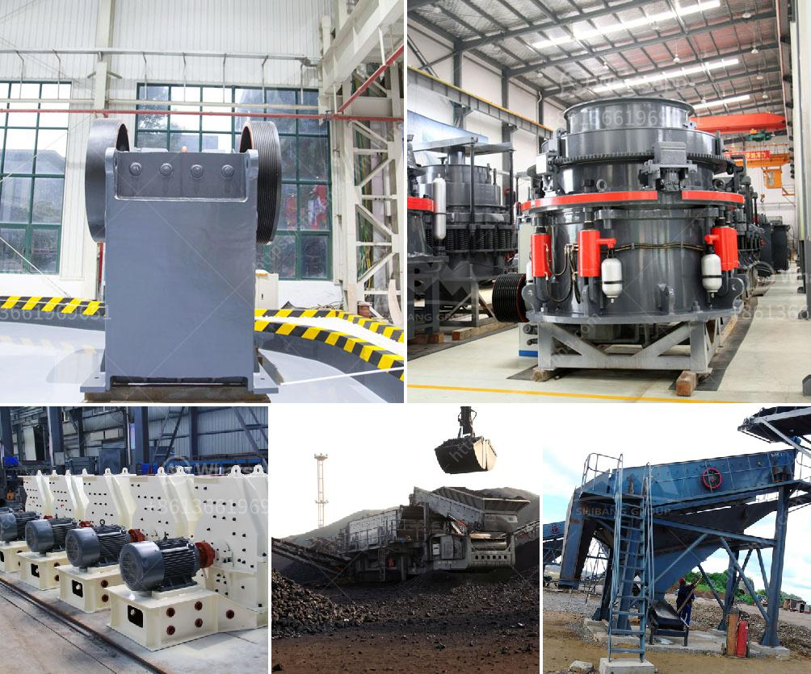

<h3>grinder machine for quartz</h3>
Quartz is a mineral that has many uses. It is one of the most abundant minerals found on our planet. Quartz is used in various industries, from glassmaking to electronics, due to its durability and versatility. However, to get quartz in the desired size and shape, it needs to undergo precision grinding with the help of a grinder machine. In this article, we will explore the importance of grinder machines for quartz and how they unlock the power of precision grinding.

A grinder machine for quartz is a high-powered device used to crush and grind quartz minerals into smaller particles for further processing. These machines are designed to handle a wide range of materials, such as rocks, minerals, and ores. The primary purpose of a grinder machine is to reduce the size of the material to make it suitable for various applications.

One of the critical features of a grinder machine for quartz is its ability to generate uniform and consistent particle sizes. This precision grinding ensures that the quartz particles have the same size distribution, which is crucial in applications like glassmaking and electronics manufacturing. A uniform particle size distribution allows for better control over the final product's quality, ensuring optimal performance and functionality.

The key component of a grinder machine is the grinding wheel. The grinding wheel is made up of abrasive particles bonded together to form a rotating wheel. These abrasive particles vary in size and hardness, depending on the material being ground. For quartz grinding, the grinding wheel needs to be made from high-quality abrasives that can withstand the hardness of quartz.

Grinder machines for quartz are available in various types, depending on the desired application and grinding requirements. Some common types include ball mills, hammer mills, and vertical mills. These machines differ in terms of speed, capacity, and grinding mechanism. Ball mills, for example, use rotating cylinders filled with quartz and grinding media to crush and grind the material. Hammer mills, on the other hand, use hammers or blades that strike and break the quartz particles into smaller pieces.

In addition to precision grinding, grinder machines for quartz also offer the advantage of efficient and energy-saving operations. These machines are designed to minimize energy consumption while maximizing productivity. Advanced grinding technologies, such as automated controls and monitoring systems, ensure that the grinding process is optimized for efficiency. This not only reduces energy costs but also increases the lifespan of the machine.

Furthermore, grinder machines for quartz are built to withstand the harsh conditions of industrial environments. These machines are constructed from durable materials, such as stainless steel and cast iron, to ensure long-lasting performance. They are also equipped with safety features, such as electrically interlocked guards and emergency stop buttons, to protect operators from potential accidents.

In conclusion, grinder machines for quartz play a vital role in unlocking the power of precision grinding. With their ability to generate uniform and consistent particle sizes, these machines are critical in various industries that rely on quartz for their products. Furthermore, the efficient and energy-saving operations of these machines make them a valuable asset in any industrial setting. So, if you're in the quartz business, investing in a high-quality grinder machine will undoubtedly enhance your productivity and ensure the production of superior quartz-based products.
<h3>Contact us</h3><ul><li><strong>Whatsapp:&nbsp;<a href="https://wa.me/8613661969651">+8613661969651</a></strong></li><li><a href="https://swt.shibang-china.com/?git&amp;zhl&amp;grinder machine for quartz"><strong>Online Service(chat now)</strong></a></li></ul><h3>Related</h3><ul><li><a href='jaw crusher machine in dubai.md'>jaw crusher machine in dubai</a></li><li><a href='mobile crushers ghana.md'>mobile crushers ghana</a></li><li><a href='aggregate crusher plants machinery.md'>aggregate crusher plants machinery</a></li><li><a href='grinding mill machine in zimbabwe.md'>grinding mill machine in zimbabwe</a></li><li><a href='industrial mineral silica sand.md'>industrial mineral silica sand</a></li></ul>