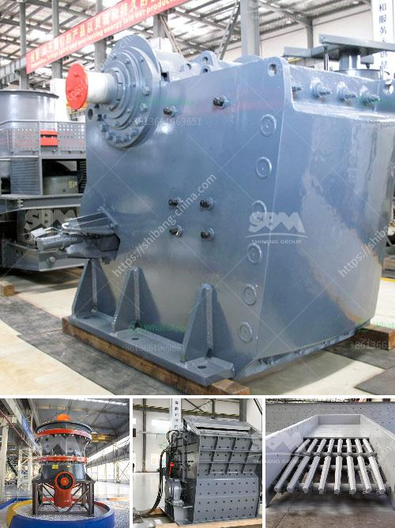

<h3>grinder mill in bolivia</h3>
In the heart of Bolivia lies a hidden gem, the grinder mill; an indispensable aspect of traditional Bolivian cuisine. Beyond its function as a processing tool, this piece of equipment symbolizes the rich cultural heritage and gastronomic delights of Bolivia. With its profound historical significance and distinct influence on local cuisine, the grinder mill has become an inherent part of Bolivian identity.

The grinder mill, locally known as "molino," has a long-standing presence in Bolivian history. Introduced during the Spanish colonization period, this milling method quickly became popular due to its efficiency in processing grains, spices, and herbs. Originally, the mill was operated manually, requiring physical exertion to produce finely ground powders.

Bolivian cuisine is characterized by its diversity, the use of native ingredients, and the preservation of traditional cooking methods. The grinder mill plays an indispensable role in faithfully preparing traditional recipes that have been passed down through generations. This equipment is essential for transforming ingredients like dried corn kernels, toasted peanuts, quinoa, and spices into fine powders or pastes, forming the base of many beloved Bolivian dishes.

One iconic Bolivian delicacy that relies heavily on the grinder mill is "llajwa," a spicy condiment made from roasted tomatoes, onions, chili peppers, and herbs. By grinding these ingredients together, the grinder mill is responsible for achieving the desired consistency and balance of flavors that make llajwa a regional favorite.

Another classic Bolivian preparation, "chuño," involves transforming potatoes into a freeze-dried product. In this process, the grinder mill is used to crush the potatoes into a pulp, which is subsequently frozen and then thawed, resulting in an easily stored and consumed food staple.

In addition to these examples, the grinder mill is also utilized in preparing "salteñas" (a savory pastry filled with meat and vegetables), "api" (a traditional hot beverage made from purple corn flour), and various types of sauces and salsas that accompany Bolivian dishes.

Beyond its practical function, the grinder mill acts as a focal point for communal activities. In many Bolivian villages, it is not uncommon to see community members gathering around an outdoor millstone, engaging in lively conversations as they mill their ingredients together. This communal practice fosters a sense of unity and strengthens the cultural bond among Bolivian communities, creating lasting memories and promoting cultural continuity.

The grinder mill is not just a utensil in Bolivian kitchens; it embodies the essence of Bolivian cuisine and culture. Its historical significance, pivotal role in traditional recipes, and its ability to bring people together highlight its importance within Bolivia's culinary heritage. As Bolivia continues to celebrate its gastronomic riches, it is imperative to recognize and preserve the cultural value and heritage embodied by the grinder mill.
<h3>Contact us</h3><ul><li><strong>Whatsapp:&nbsp;<a href="https://wa.me/8613661969651">+8613661969651</a></strong></li><li><a href="https://swt.shibang-china.com/?git&amp;zhl&amp;grinder mill in bolivia"><strong>Online Service(chat now)</strong></a></li></ul><h3>Related</h3><ul><li><a href='gypsum powder production plant ppt.md'>gypsum powder production plant ppt</a></li><li><a href='quarrying crusher in zimbia.md'>quarrying crusher in zimbia</a></li><li><a href='how many jaw crusher manufacturer company in india.md'>how many jaw crusher manufacturer company in india</a></li><li><a href='coal mining equipment manufacturers in south africa.md'>coal mining equipment manufacturers in south africa</a></li><li><a href='buyers ball mill process.md'>buyers ball mill process</a></li></ul>