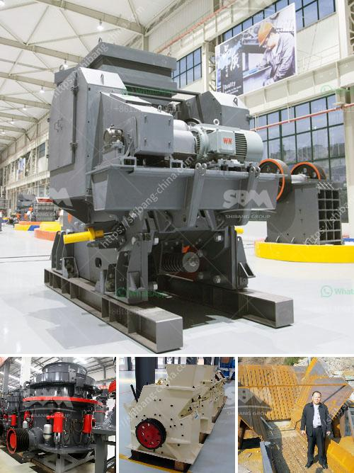

<h3>grinding ball for ball mills</h3>
Grinding balls for ball mills are essential accessories in any mining or ore processing operation. They are used for grinding minerals down to a smaller size, making them easier to extract or work with. The grinding balls have a significant impact on the efficiency of the mill and the quality of the final product.

The key characteristic of grinding balls is their hardness, which determines their ability to resist wear and impact during the grinding process. The hardness of grinding balls is usually measured on the Rockwell scale, with higher numbers indicating greater hardness. Harder grinding balls have a longer lifespan and can withstand more extreme conditions, such as high temperatures or corrosive environments.

Grinding balls for ball mills are made from various materials, such as steel, cast iron, ceramic, or rubber. They are available in different sizes, ranging from 10mm to 150mm in diameter and weights between 1kg and 10kg. The size and material of the grinding balls depend on the type of mill and the desired grinding outcome.

The grinding balls are loaded into the mill along with the material to be ground, and as the mill rotates, the balls cascade and crush the material into finer particles. This process is known as attrition or impact grinding. The efficiency of the grinding process depends on the size and quantity of the grinding balls, the speed of the mill, and the consistency of the material being ground.

In addition to hardness, other factors to consider when selecting grinding balls include their density, chemical composition, and shape. These factors can impact the grinding efficiency and the quality of the final product. For example, grinding balls with a higher density can promote a more effective grinding action, while balls with a well-designed shape can enhance the mixing and dispersion of the material being ground.

In conclusion, grinding balls for ball mills play a vital role in ore processing operations. Their hardness, size, material, and shape significantly impact the efficiency and quality of the grinding process. Choosing the right grinding balls for a specific application is crucial to optimize performance and achieve the desired grinding outcome.
<h3>Contact us</h3><ul><li><strong>Whatsapp:&nbsp;<a href="https://wa.me/8613661969651">+8613661969651</a></strong></li><li><a href="https://swt.shibang-china.com/?git&amp;zhl&amp;grinding ball for ball mills"><strong>Online Service(chat now)</strong></a></li></ul><h3>Related</h3><ul><li><a href='crusher for pozzolana.md'>crusher for pozzolana</a></li><li><a href='cone crusher manufacturer in south africa.md'>cone crusher manufacturer in south africa</a></li><li><a href='calcium carbonate production plant.md'>calcium carbonate production plant</a></li><li><a href='buyers ball mill process.md'>buyers ball mill process</a></li><li><a href='china quarrying machine prices china.md'>china quarrying machine prices china</a></li></ul>