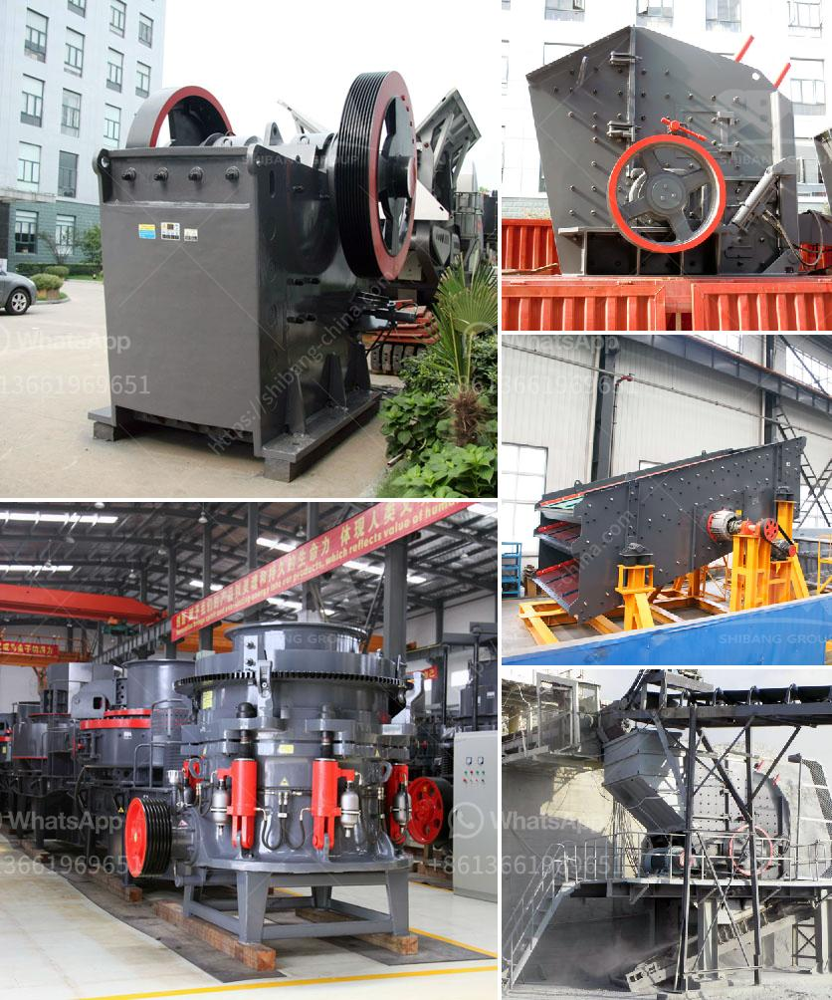

<h3>grinding ball mill philippines</h3>
In the mining industry, the grinding ball mill is widely used as a finishing process. It is responsible for final processing, which is essential in the preparation of minerals, coal, and other materials. Grinding ball mill has properties like low energy consumption, low investment cost, high grinding efficiency, and easy operation, making it one of the most commonly used equipment in the mining industry.

The Philippines, being rich in mineral resources, has seen a surge in mining activities in recent years. This has led to an increased demand for grinding mills, particularly ball mills. As the country experiences rapid industrialization, there is a need for more raw materials, which drives the need for efficient grinding equipment like ball mills.

One of the key factors contributing to the growing popularity of grinding ball mills in the Philippines is their versatility in processing different materials. Ball mills can grind various ores and other materials, such as cement, silicates, refractory materials, fertilizer, glass ceramics, and even some ferrous and non-ferrous metals. This makes them suitable for a wide range of applications in the mining industry.

Another advantage of using grinding ball mills in the Philippines is the low energy consumption. Compared to traditional mills, ball mills require less power for operation. This is due to the unique design and mechanism of the grinding media, which efficiently breaks down the materials and reduces the need for excessive energy input. As a result, mining companies can save on energy costs while achieving the desired grinding performance.

Investing in grinding ball mills also has financial advantages. The initial investment cost of a ball mill may be higher than other grinding equipment. However, the long-term benefits outweigh the upfront expenses. Ball mills have a high grinding efficiency, which means they can process more material in a shorter time compared to other mills. This translates to higher production rates and increased revenue for mining companies.

Moreover, ball mills are relatively easy to operate. They require minimal supervision and maintenance, making them ideal for mining operations, especially in remote areas. Their simplicity in design and operation means less downtime and faster production, ensuring a continuous supply of processed materials.

As the demand for minerals and other resources continues to grow, the grinding ball mill market in the Philippines expands as well. Mining companies are increasingly investing in these mills to meet the production demands and maintain their competitive edge. With the advantages they offer in terms of processing efficiency, cost-effectiveness, and ease of operation, grinding ball mills have become a staple in the mining industry.

In conclusion, the Philippines' mining industry is experiencing a surge in demand for grinding ball mills. These mills are versatile, energy-efficient, and cost-effective, making them a preferred choice for mining companies. With their ability to process a wide range of materials and their low energy consumption, ball mills are essential for the finishing process in mining operations. As the industry continues to expand, the demand for grinding ball mills in the Philippines is expected to grow further.
<h3>Contact us</h3><ul><li><strong>Whatsapp:&nbsp;<a href="https://wa.me/8613661969651">+8613661969651</a></strong></li><li><a href="https://swt.shibang-china.com/?git&amp;zhl&amp;grinding ball mill philippines"><strong>Online Service(chat now)</strong></a></li></ul><h3>Related</h3><ul><li><a href='high pressure grinding mill.md'>high pressure grinding mill</a></li><li><a href='small rock crushers in turkey.md'>small rock crushers in turkey</a></li><li><a href='rotary dryer sales indonesia.md'>rotary dryer sales indonesia</a></li><li><a href='copper ore concentrator suppliers india.md'>copper ore concentrator suppliers india</a></li><li><a href='malaysia tin ore cursher supplier.md'>malaysia tin ore cursher supplier</a></li></ul>