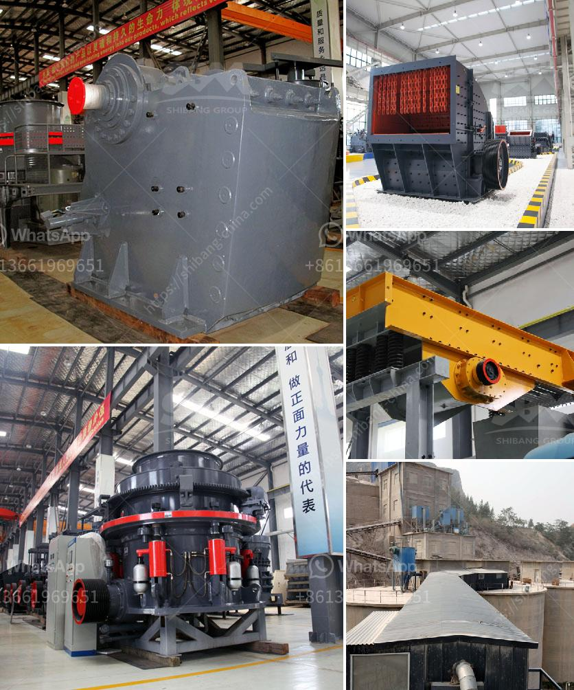

<h3>grinding ball mill</h3>
A grinding ball mill is a type of machinery used to grind, blend, and sometimes for mixing of materials for use in various types of industries. A ball mill works on the principle of impact and attrition: size reduction is done by impact as the balls drop from near the top of the shell.

The grinding media are usually steel or ceramic balls of varying sizes, depending on the feed size, work index of the ore, and the desired product size. Grinding balls are used to perform the crucial function of grinding the material into the desired size, making them suitable for use in a variety of applications.

In order to operate a ball mill efficiently, several factors need to be considered. The mill should be operated with the correct amount of grinding media, which ensures optimal grinding performance and minimal wear on the mill liners. The mill should also be operated at the correct speed to achieve the desired product size. Additionally, regular maintenance and inspection of the mill is crucial to ensure its smooth operation and efficiency.

The grinding ball mill is widely used in industries such as mining, cement, power generation, and more. It offers several advantages over other types of mills, including its low maintenance requirements, high grinding efficiency, and flexibility in either wet or dry grinding applications.

Furthermore, the grinding ball mill can be used for both coarse and fine grinding, making it suitable for a wide range of applications. It can be used to grind materials with Mohs hardness levels of up to 9.3, ensuring that it can handle even the toughest materials.

To conclude, the grinding ball mill is a versatile and efficient piece of machinery that is essential in many industries. Its ability to grind, blend, and mix various materials makes it a valuable tool for achieving the desired product size and quality. Whether it is used for grinding ores, minerals, or other materials, the grinding ball mill is a reliable and effective solution.
<h3>Contact us</h3><ul><li><strong>Whatsapp:&nbsp;<a href="https://wa.me/8613661969651">+8613661969651</a></strong></li><li><a href="https://swt.shibang-china.com/?git&amp;zhl&amp;grinding ball mill"><strong>Online Service(chat now)</strong></a></li></ul><h3>Related</h3><ul><li><a href='mobile crusher in fiji.md'>mobile crusher in fiji</a></li><li><a href='china rock crusher.md'>china rock crusher</a></li><li><a href='iron ore crusher units in orissa.md'>iron ore crusher units in orissa</a></li><li><a href='plant for manufacturing of wet ground calcium carbonate.md'>plant for manufacturing of wet ground calcium carbonate</a></li><li><a href='calcite crushing machine.md'>calcite crushing machine</a></li></ul>