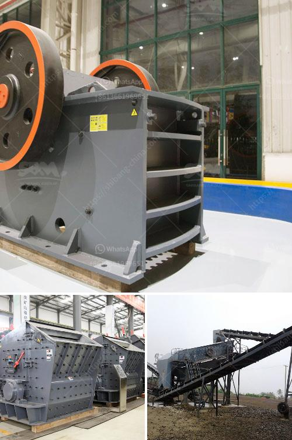

<h3>grinding grinding equipment grinding</h3>
When it comes to shaping and smoothing surfaces, grinding techniques and equipment play a crucial role in various industries. From metalworking and woodworking to construction and manufacturing, grinding allows for precise material removal and surface refinement. In this article, we will explore the art and science of grinding, the different types of grinding equipment available, and how they contribute to achieving excellent results.

Grinding is a process used to remove unwanted material to create a desired shape or finish on a workpiece. It involves rubbing the workpiece against a hard, abrasive surface to remove excess material and improve its surface quality. This mechanical process is essential for achieving dimensional accuracy and surface integrity, making it an integral part of numerous industries.

One of the key factors in achieving successful grinding outcomes is selecting the appropriate grinding equipment. The market offers a wide range of grinding machines, each designed to cater to specific material removal requirements. Let's delve into some common grinding equipment types:

1. Surface Grinders: These machines are ideal for achieving a smooth and flat surface finish. Surface grinders use a rotating grinding wheel to remove material from the surface of a workpiece, creating a consistent, uniform finish. Perfect for applications involving precision grinding, surface grinders are widely used in metalworking, woodworking, and manufacturing industries.

2. Centerless Grinders: As the name suggests, centerless grinders do not require a center to hold the workpiece. Instead, they employ a regulating wheel and a grinding wheel to remove material from the workpiece accurately. Centerless grinders excel in high-production environments, offering a reliable and efficient solution for grinding cylindrical parts, such as shafts and pins.

3. Cylindrical Grinders: Cylindrical grinding machines specialize in grinding the outer surface of cylindrical workpieces. By rotating the workpiece against a grinding wheel, cylindrical grinders can create precise shapes, sizes, and finishes on a wide range of materials. This makes them indispensable in industries such as automotive, aerospace, and medical device manufacturing.

4. Tool and Cutter Grinders: These specialized machines are designed for reshaping and sharpening cutting tools used in various industries. From drills and end mills to broaches and reamers, tool and cutter grinders ensure the longevity and performance of cutting tools by accurately grinding and reshaping their cutting edges.

Grinding is a versatile process that can be performed manually or using computer numerical control (CNC) technology. While manual grinding provides flexibility, CNC grinding offers increased precision and automation, allowing for consistent results and reducing human error.

In conclusion, grinding is a vital process that contributes to achieving precise shape, size, and finish requirements in multiple industries. Whether it's surface grinding, centerless grinding, cylindrical grinding, or tool and cutter grinding, the right equipment selection is crucial to ensure optimal results. The art and science of grinding continuously evolve, leading to the development of more advanced grinding machines that cater to specific material removal needs.
<h3>Contact us</h3><ul><li><strong>Whatsapp:&nbsp;<a href="https://wa.me/8613661969651">+8613661969651</a></strong></li><li><a href="https://swt.shibang-china.com/?git&amp;zhl&amp;grinding grinding equipment grinding"><strong>Online Service(chat now)</strong></a></li></ul><h3>Related</h3><ul><li><a href='feldspar stone crushing plant.md'>feldspar stone crushing plant</a></li><li><a href='grinding ball for ball mills.md'>grinding ball for ball mills</a></li><li><a href='difeerence between jow crusher and hammer mill.md'>difeerence between jow crusher and hammer mill</a></li><li><a href='price list for crusher machine sayaji.md'>price list for crusher machine sayaji</a></li><li><a href='copper processing stages.md'>copper processing stages</a></li></ul>