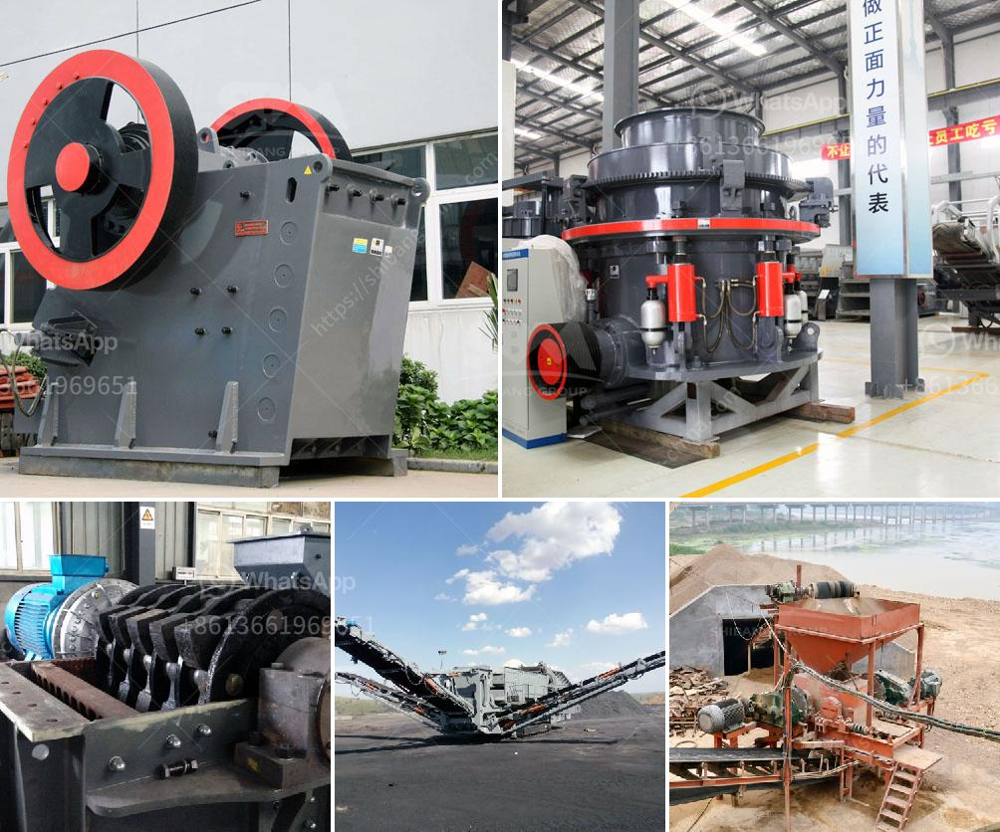

<h3>grinding machine activated carbon</h3>
Activated carbon has been widely used in various industries due to its excellent adsorption capacity and high surface area. It is commonly used in the purification of drinking water, extraction of metals, air purification, and removal of toxins and impurities from industrial gases. To utilize activated carbon effectively, it is crucial to ensure its fine particle size, which can be achieved through the use of grinding machines.

Grinding machines are devices that ensure the desired particle size of a material through grinding and crushing. In the case of activated carbon, grinding machines are used to process raw materials into a fine powder, which is then added to various products or processes as an adsorbent.

One of the key advantages of grinding machines for activated carbon is their ability to produce a consistent particle size. The size of the carbon particles significantly affects its adsorption capacity. A fine particle size guarantees a larger surface area per unit mass, allowing for more effective adsorption of impurities or contaminants.

Moreover, grinding machines are essential in reducing the size of large activated carbon granules or lumps, which may be unsuitable for certain applications. By breaking down these large particles into smaller sizes, the adsorption process can be optimized, and the efficiency of the activated carbon can be enhanced.

There are several types of grinding machines available for processing activated carbon, including ball mills, vibratory mills, pin mills, and jet mills. These machines employ different mechanisms to achieve the desired particle size reduction. For instance, ball mills use grinding media such as steel balls or ceramic beads to crush the carbon particles, while vibratory mills rely on the impact and vibration to achieve the same effect.

The selection of the appropriate grinding machine depends on various factors, including the desired particle size range, the specific properties of the activated carbon, and the throughput capacity required. It is crucial to choose a machine that can deliver the desired results effectively and efficiently.

In addition to their role in size reduction, grinding machines for activated carbon also contribute to the purification process by ensuring the absence of impurities. The grinding equipment should be made from materials that are compatible with activated carbon to prevent contamination or degradation of the adsorbent.

In conclusion, grinding machines play a vital role in the processing of activated carbon. They are essential for achieving a fine particle size, improving the adsorption capacity, and ensuring the absence of impurities. With the proper selection and operation of grinding machines, activated carbon can be utilized more effectively in various applications, offering enhanced purification and adsorption capabilities.
<h3>Contact us</h3><ul><li><strong>Whatsapp:&nbsp;<a href="https://wa.me/8613661969651">+8613661969651</a></strong></li><li><a href="https://swt.shibang-china.com/?git&amp;zhl&amp;grinding machine activated carbon"><strong>Online Service(chat now)</strong></a></li></ul><h3>Related</h3><ul><li><a href='cement production machinery.md'>cement production machinery</a></li><li><a href='talcum powder supplier for production.md'>talcum powder supplier for production</a></li><li><a href='schenck weighbelt feeders calibration procedure.md'>schenck weighbelt feeders calibration procedure</a></li><li><a href='grinding marble stone price.md'>grinding marble stone price</a></li><li><a href='super fine powder mill.md'>super fine powder mill</a></li></ul>