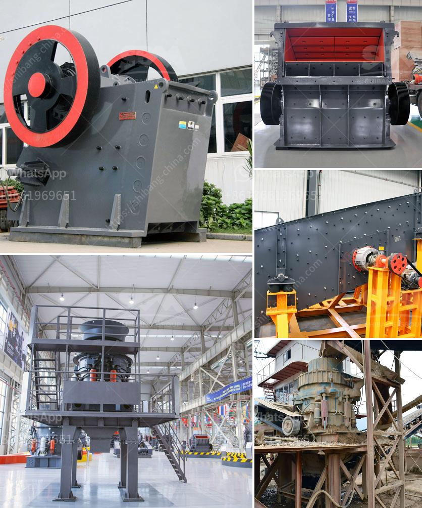

<h3>grinding machine for making fine powder</h3>
In today's industrial world, one of the most important steps is making fine powder. This process plays a significant role in various industries like pharmaceutical, food processing, chemical, and many others. To achieve desired results, it's crucial to have the right equipment, and that's where grinding machines come into play. Grinding machines are an essential tool designed to break down coarse materials into fine powders efficiently and effectively. In this article, we will explore the world of grinding machines and their importance in the manufacturing process.

A grinding machine is a power tool used to precisely shape and finish the given material with utmost precision. The primary function of these machines is to grind a material into smaller particles, creating a fine powder. A grinding machine is composed of numerous tiny abrasive grains called grinding wheels, each with its unique grit size, bonding materials, and abrasive particles. These individual grains, when interacted with the workpiece, cause abrasion and cutting actions, resulting in the desired shape and form.

Grinding machines are available in various types and models, depending on the nature of the work and the desired output. Traditional grinders like bench grinders or angle grinders are commonly used for smaller-scale tasks, such as sharpening cutting tools or smoothing rough edges. However, when it comes to making fine powder, specialized grinding machines with advanced features and capabilities are required.

The grinding machines used for making fine powder are often sophisticated and expensive. These machines typically employ advanced grinding mechanisms, such as turbine grinders, attrition mills, and hammer mills. These methods are generally more effective than traditional grinding methods resulting in a finer, more uniform powder. Furthermore, these machines may also incorporate additional features like sieving or screening devices to ensure the particle sizes are within the desired range.

The benefits of using a grinding machine for making fine powder are numerous. Firstly, the particle size obtained can be easily controlled, ensuring a consistent and reproducible end product. This is particularly important in industries where powder consistency and quality are critical, such as pharmaceuticals. Secondly, the use of grinding machines significantly reduces the time and effort required, as compared to manual grinding methods. Additionally, since grinding machines are designed for continuous operation, they offer higher productivity levels, allowing industries to produce large quantities of fine powder efficiently.

When choosing a suitable grinding machine for making fine powder, several factors need consideration. It's important to assess your specific needs, including the intended application, required output capacity, and maintenance requirements. Additionally, factors like energy consumption, safety features, and ease of use should also be considered before making a final decision. Consulting with experts or manufacturers in the field can help identify the most suitable grinding machine for your specific requirements.

In conclusion, a grinding machine for making fine powder is an essential tool in various industries. Its ability to precisely shape and finish materials into a fine powder ensures a consistent and high-quality end product. With advanced features and grinding mechanisms, these machines provide efficient and reliable processing for industries relying on powdered materials. Investing in a grinding machine tailored to your needs can enhance productivity and streamline manufacturing processes, making it a must-have in your industrial arsenal.
<h3>Contact us</h3><ul><li><strong>Whatsapp:&nbsp;<a href="https://wa.me/8613661969651">+8613661969651</a></strong></li><li><a href="https://swt.shibang-china.com/?git&amp;zhl&amp;grinding machine for making fine powder"><strong>Online Service(chat now)</strong></a></li></ul><h3>Related</h3><ul><li><a href='ball mill design calculation pdf.md'>ball mill design calculation pdf</a></li><li><a href='coal crusher machine prices in india.md'>coal crusher machine prices in india</a></li><li><a href='method statement of installation conveyor belt.md'>method statement of installation conveyor belt</a></li><li><a href='grinding mill machine in zimbabwe.md'>grinding mill machine in zimbabwe</a></li><li><a href='companies that sell industrial ball mills in malaysia.md'>companies that sell industrial ball mills in malaysia</a></li></ul>