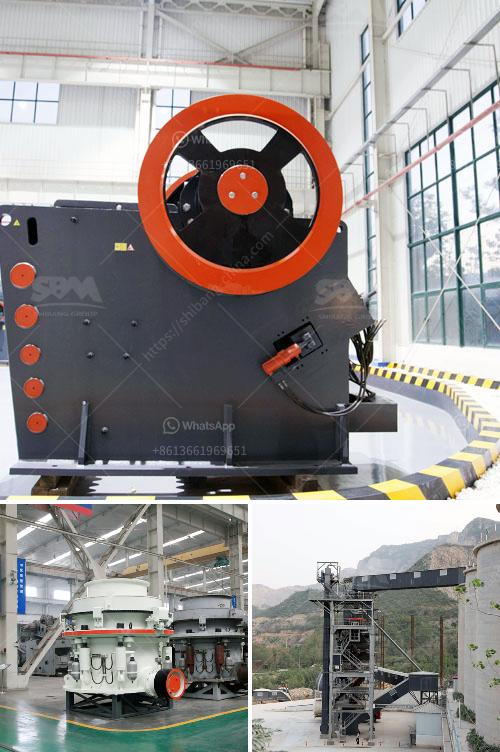

<h3>grinding machine for salt in pakistan</h3>
Grinding machines are used to grind raw materials into powdered form and are widely used in the production of various powders such as salt, spices, silica, and many more. In Pakistan, the grinding machines have flourished as an essential kitchen tool due to their effectiveness in grinding, blending, and mixing various ingredients. Among these, the grinding machine for salt in Pakistan has gained immense popularity.

Salt is one of the essential ingredients used in Pakistani cuisine. It adds flavor, enhances the taste profile, and is also essential for preserving several foods. Pakistani cuisine is known for its rich flavor combinations, and salt plays a significant role in achieving that perfect taste. The grinding machine for salt in Pakistan simply grinds larger salt particles into fine powder, making it easier to blend with other spices and ingredients.

The grinding machine for salt in Pakistan is generally composed of three parts: the grinding mechanism, the grinding wheel, and the grinding capacity. These parts are crucial in terms of the functionality and efficiency of the machine. The grinding mechanism is responsible for grinding the salt particles into powdered form. It typically consists of stainless steel blades or burrs that rotate at high speed, effectively pulverizing the salt crystals.

The grinding wheel is another crucial component of the machine, as it determines the fineness of the salt powder. Different grinding machines for salt in Pakistan may have various grinding wheels, ranging from fine to coarse. It allows the user to adjust the desired coarseness according to their personal preferences or the specific recipe requirements. For instance, some recipes call for fine salt powder, while others may require coarse salt particles.

Furthermore, the grinding capacity is another important aspect to consider when choosing a grinding machine for salt in Pakistan. The grinding capacity determines the amount of salt that can be ground at a time. Higher grinding capacity means more salt can be processed in less time. Consequently, it reduces the overall preparation time, making the grinding process more efficient.

In Pakistan, the grinding machine for salt is available in various sizes and designs. Some are manual, requiring the user to rotate the grinding wheel manually, while others come with an electric motor, enabling automatic grinding. The availability of different options caters to the diverse preferences and needs of users.

Moreover, the grinding machine for salt in Pakistan is not limited to domestic use. It is also widely used in commercial kitchens, restaurants, and food processing industries. These machines offer quick and efficient grinding, allowing the production of large quantities of powdered salt for commercial purposes.

To summarize, the grinding machine for salt in Pakistan has revolutionized the culinary world. It provides a convenient way to grind salt into powdered form, making it easier to incorporate into various recipes. The grinding mechanism, wheel, and capacity are key factors that determine the efficiency and functionality of the machine. From domestic to commercial use, these machines have become an integral part of Pakistani kitchens and food processing industries.
<h3>Contact us</h3><ul><li><strong>Whatsapp:&nbsp;<a href="https://wa.me/8613661969651">+8613661969651</a></strong></li><li><a href="https://swt.shibang-china.com/?git&amp;zhl&amp;grinding machine for salt in pakistan"><strong>Online Service(chat now)</strong></a></li></ul><h3>Related</h3><ul><li><a href='stone crusher machine price in africa south.md'>stone crusher machine price in africa south</a></li><li><a href='jual mesin hammer mill crusher for sale.md'>jual mesin hammer mill crusher for sale</a></li><li><a href='dolomite crusher manufacturer in usa.md'>dolomite crusher manufacturer in usa</a></li><li><a href='vertical ultra fine pulverizer.md'>vertical ultra fine pulverizer</a></li><li><a href='cone crusher manufacturer in south africa.md'>cone crusher manufacturer in south africa</a></li></ul>