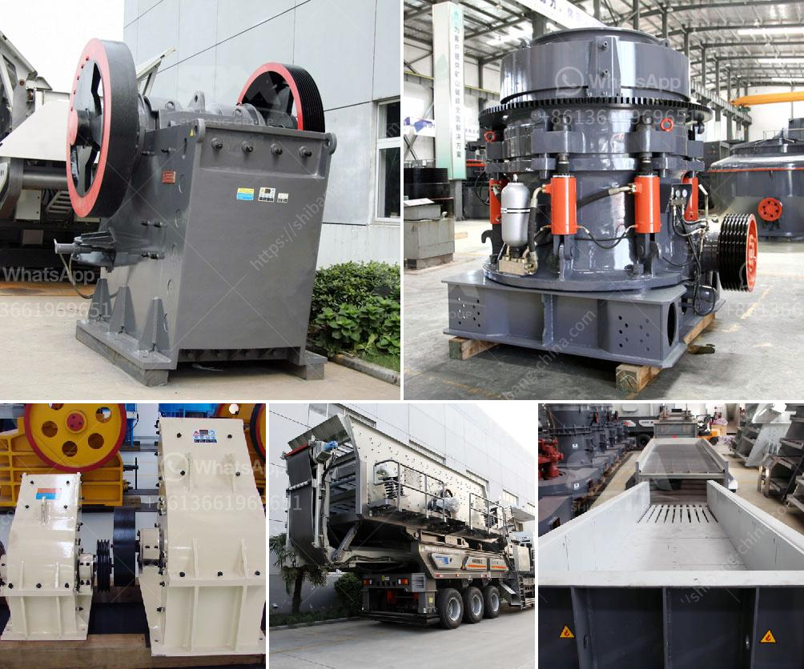

<h3>grinding machine information in hindi</h3>
ग्राइंडिंग मशीन एक महत्वपूर्ण उपकरण है जो विभिन्न प्रकार के काम को सरल और सुरक्षित बनाने में मदद करता है। इसका उपयोग विभिन्न घटकों को आकार देने, ढालते या पारग्राइंडिंग (ग्राइंडिंग) करने में किया जाता है। यह मशीन उच्च गुणवत्ता और स्थिरता का एक उत्कृष्ट स्रोत होती है, जो विभिन्न उद्योगों में उपयोग की जाती है।

ग्राइंडिंग मशीनों का उपयोग चिपचिपी या पुनर्निर्माण वाली सतहों को साफ करने, धातु टूल्स के आवरण को हटाने, मशीनी प्रक्रियाएं सार्वजानिक आवश्यकता के लिए तैयार करने, घास की छोटी टुकड़ीयों को छांटने, आदि में किया जा सकता है। यह मशीन पहले से तैयार किये गए उपयोग के लिए तैयार नहीं होती और प्रत्येक काम के लिए उपयोगकर्ता द्वारा अद्यतित की जानी चाहिए।

ग्राइंडिंग मशीन के प्रकार कई होते हैं। सर्फेस ग्राइंडर, सेंटरलेस ग्राइंडर, सुखा-नम ग्राइंडर, हॉराइज़ॉन्टल स्पिंडल और सुखा ग्राइंडर इनमे से कुछ प्रसिद्ध अनुप्रयोग हैं। सर्फेस ग्राइंडर उपयोगकर्ता की आवश्यकताओं के अनुसार उपयोग के लिए आदर्श है, जबकि सेंटरलेस ग्राइंडर छोटे ताल-पतथर तक घटकों को ग्राइंड करने के लिए बहुत उपयुक्त होता है। और इसी तरह, अन्य ग्राइंडिंग मशीनों की विशेषताओं को उपयोगकर्ता की आवश्यकताओं के अनुसार ग्राइंडिंग प्रक्रियाओं के लिए चुना जा सकता है।

ग्राइंडिंग मशीनों की कार्यप्रणाली बहुत सरल होती है। प्राथमिक रूप से, एक ग्राइंडर के केंद्र में गति कैलेंडर द्वारा अनुसरण की जाती है जो कि पसंत भार को निर्धारित करती है। निर्धारित भार पर ही ग्राइंडिंग टूल इर्द गिर्द चक्रवाती बीम पर घूरता है और कन्नीत घटक को संपादित करता है।

उत्पादन कार्यक्षेत्रों में ग्राइंडिंग मशीन का महत्वपूर्ण उपयोग होता है। यह उच्च गुणवत्ता स्तर और सुरक्षित प्रक्रिया सुनिश्चित करने में मदद करती है, इसलिए उत्पादन के मानकों को पूरा करने के लिए अत्यंत महत्वपूर्ण होता है। इसके अलावा, यह मशीन उचित काम करने की शक्ति और क्षमता द्वारा भी महत्वपूर्ण होती है, जो कि किसी भी उद्योग में अनुकूलन कर सकती है।

यदि आप ग्राइंडिंग मशीन को खरीदने या उपयोग करने की सोच रहे हैं, तो आपको इसकी जानकारी और प्रयोग के बारे में कुछ भी विशेष ध्यान देना चाहिए। यह मशीन सुरक्षित तरीके से उपयोग करना चाहिए और पूर्ण तरीके से निरामय स्थानीयता की जरूरत होती है। उच्च गुणवत्ता और स्थिरता एक ग्राइंडिंग मशीन के सबसे महत्वपूर्ण विशेषताएं होती हैं, इसलिए उचित ध्यान देना चाहिए।

संक्षेप में, ग्राइंडिंग मशीन एक महत्वपूर्ण उपकरण है जो विभिन्न प्रकार के काम को सरल, आकर्षक और सुरक्षित बनाने में मदद करता है। इस मशीन का उपयोग उच्च गुणवत्ता उत्पादन और उचित काम करने के लिए आवश्यक होता है। प्राइस, ब्रांड और संबंधित प्रश्नों पर विचार करने से पहले सही जानकारी और सीखने की आवश्यकता होती है।
<h3>Contact us</h3><ul><li><strong>Whatsapp:&nbsp;<a href="https://wa.me/8613661969651">+8613661969651</a></strong></li><li><a href="https://swt.shibang-china.com/?git&amp;zhl&amp;grinding machine information in hindi"><strong>Online Service(chat now)</strong></a></li></ul><h3>Related</h3><ul><li><a href='calcite crusher for sale.md'>calcite crusher for sale</a></li><li><a href='american stone crusher price.md'>american stone crusher price</a></li><li><a href='used hammer mill crushers.md'>used hammer mill crushers</a></li><li><a href='design of harmer mill.md'>design of harmer mill</a></li><li><a href='used air classifier mills for sale.md'>used air classifier mills for sale</a></li></ul>