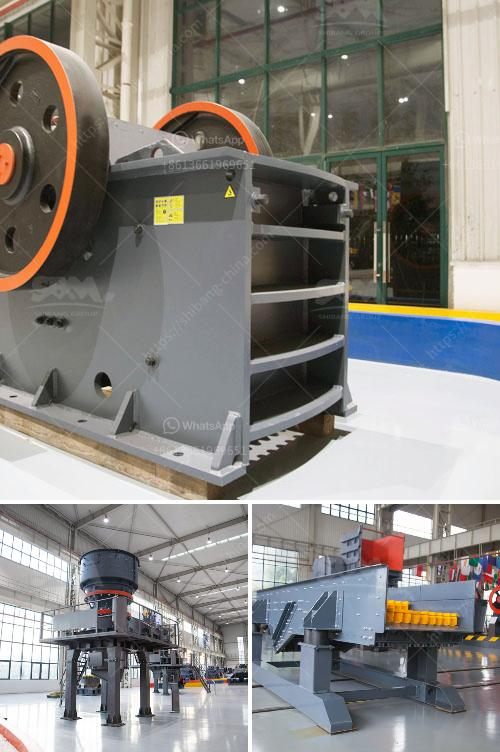

<h3>grinding machine specification india price</h3>
Grinding machines are tools used in the process of grinding and are important for various industrial sectors. Grinding machines come in different sizes and shapes and are used for a variety of purposes. India is a fast-growing market for grinding machines and with the increasing demand for these machines, there are several manufacturers and suppliers of grinding machines in the country. Here we take a look at some of the specifications and prices of popular grinding machines in India.

Grinding machines are classified based on their structure and the work they do. The most widely used grinding machines are cylindrical grinding machines, surface grinding machines, tool and cutter grinding machines, jig grinding machines, gear grinding machines, internal grinding machines, and centerless grinding machines.

Cylindrical grinding machines are used to shape the outer surface of a workpiece. These machines are ideal for both single-piece and batch production. The grinding wheel rotates on its axis and the workpiece is mounted on a chuck or between centers. Cylindrical grinding machines are available in various sizes, shapes, and configurations, and their prices range from around Rs. 5,000 to Rs. 10,00,000 based on the specifications.

Surface grinding machines are used to produce a smooth finish on flat surfaces. These machines consist of a grinding wheel, a chuck, and a reciprocating table. Surface grinding machines can be manually operated or computer-controlled. The specifications and prices of surface grinding machines in India vary widely based on the type of machine, the grinding wheel size, and the power required.

Tool and cutter grinding machines are used to sharpen tools such as milling cutters and drills. These machines have a high degree of precision and accuracy and are ideal for regrinding and manufacturing various types of tools. The prices of tool and cutter grinding machines in India can range from Rs. 80,000 to Rs. 2 lakh based on the specifications and the type of machine.

Jig grinding machines are used for precision grinding of holes and pins. These machines are highly specialized and are often used for high precision grinding operations such as mold making, tool and die making, and precision engineering. The prices of jig grinding machines in India range from Rs. 4 lakh to Rs. 7 lakh based on the specifications and the type of machine.

Gear grinding machines are used to produce gear tooth profiles and accurately grind gears to the desired dimension and surface finish. These machines are widely used in the automotive industry and for gear manufacturing and repair. The specifications and prices of gear grinding machines in India vary depending on the type of machine, the grinding wheel size, and the power required.

Internal grinding machines are used for grinding internal surfaces of cylindrical components. These machines are widely used in the manufacturing industry for precision grinding of parts such as bearings, sleeves, and hydraulic cylinders. The prices of internal grinding machines in India range from Rs. 1.5 lakh to Rs. 5 lakh based on the specifications and the type of machine.

Centerless grinding machines are used for grinding and finishing of cylindrical workpieces without a chuck or centers. These machines use an abrasive wheel rotating at high speed to remove material from the workpiece. Centerless grinding machines are highly productive and offer high precision grinding. The prices of centerless grinding machines in India can range from Rs. 2 lakh to Rs. 3 lakh based on the specifications and the type of machine.

In conclusion, grinding machines are essential tools used in various industries for grinding, shaping, and finishing of workpieces. The specifications and prices of grinding machines in India vary widely based on the type of machine, the grinding wheel size, and the power required. It is important for buyers to evaluate their specific needs and budget before making a purchase decision. With the wide range of options available, buyers can find a grinding machine that meets their requirements within their price range in India.
<h3>Contact us</h3><ul><li><strong>Whatsapp:&nbsp;<a href="https://wa.me/8613661969651">+8613661969651</a></strong></li><li><a href="https://swt.shibang-china.com/?git&amp;zhl&amp;grinding machine specification india price"><strong>Online Service(chat now)</strong></a></li></ul><h3>Related</h3><ul><li><a href='i need for a stone crushing plant.md'>i need for a stone crushing plant</a></li><li><a href='deisel hammer mill in south africa.md'>deisel hammer mill in south africa</a></li><li><a href='conveyor belts in port system.md'>conveyor belts in port system</a></li><li><a href='quartz stone machine.md'>quartz stone machine</a></li><li><a href='small scale iron ore pallet plant.md'>small scale iron ore pallet plant</a></li></ul>