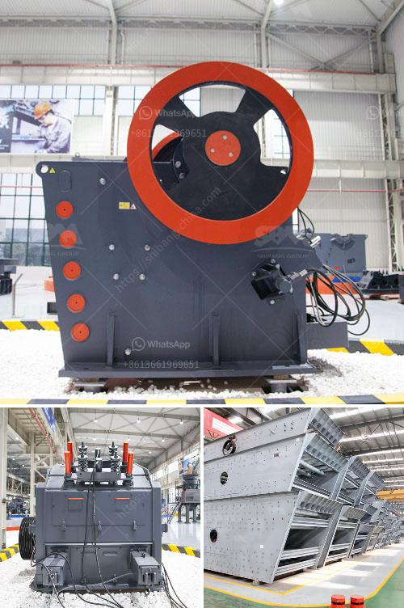

<h3>grinding marble stone price</h3>
Marble is a beautiful and natural stone that has been revered for centuries for its elegance and durability. From ancient sculptures and architecture to modern countertops and flooring, marble continues to be a popular choice for adding a touch of luxury to any space. However, with the growing demand for marble, the price of this exquisite stone has also been on the rise. In this article, we will explore the factors that influence the price of grinding marble stone and how it can vary within a range of 300-500 words.

First and foremost, the quality of the marble itself plays a significant role in determining its price. High-quality marble that is extracted from well-known quarries and possesses desirable characteristics such as uniform coloring, absence of veins or impurities, and high durability, will naturally command a higher price. This is because the process of extracting and refining such marble requires exceptional craftsmanship and meticulous attention to detail.

Another crucial factor that influences the price of grinding marble stone is the size and thickness of the slabs or tiles. Large, thick pieces of marble are more challenging to handle and require specialized equipment and expertise. Consequently, the cost of grinding and shaping these larger pieces increases. Furthermore, marble slabs or tiles with irregular shapes or custom designs will also involve additional labor and time, which adds to the overall price.

The type of finish and level of detailing desired by the customer is another determinant of the price. Marble can be finished in various ways, including polished, honed, brushed, or leathered finishes. Each finish requires different grinding techniques, and the complexity of the process may vary accordingly. Furthermore, intricate designs or patterns carved into the marble surface will demand more time and skill, thus driving up the price.

The location and availability of the marble also affect its price. Some countries are known for producing exceptional quality marble, such as Italy or Greece, and their marble is often considered more valuable and, subsequently, more expensive. Additionally, transportation costs and import duties can significantly impact the final price of marble stone in various regions or countries. The scarcity of certain types of marble due to limited quarrying or environmental restrictions can also drive up its price.

Lastly, the reputation and experience of the stone supplier or contractor will play a vital role in determining the price. Established and renowned companies with extensive experience in grinding marble stone are often sought after for their quality workmanship, which results in a higher price tag. Such companies invest in advanced machinery, employ skilled craftsmen, and provide excellent customer service, all of which contribute to the overall cost.

In conclusion, the price of grinding marble stone is influenced by several factors, including the quality of the marble, size and thickness of the slabs or tiles, type of finish desired, availability and location of the marble, and the reputation of the supplier or contractor. Before undertaking any marble grinding or installation project, it is essential to research and compare prices from different suppliers to ensure you are getting the best value for your investment.
<h3>Contact us</h3><ul><li><strong>Whatsapp:&nbsp;<a href="https://wa.me/8613661969651">+8613661969651</a></strong></li><li><a href="https://swt.shibang-china.com/?git&amp;zhl&amp;grinding marble stone price"><strong>Online Service(chat now)</strong></a></li></ul><h3>Related</h3><ul><li><a href='mini crusher roller mill.md'>mini crusher roller mill</a></li><li><a href='crusher for pozzolana.md'>crusher for pozzolana</a></li><li><a href='grinding mill machine price in chennai.md'>grinding mill machine price in chennai</a></li><li><a href='price phosphate rock crusher.md'>price phosphate rock crusher</a></li><li><a href='belt conveyor belt suppliers in oman.md'>belt conveyor belt suppliers in oman</a></li></ul>