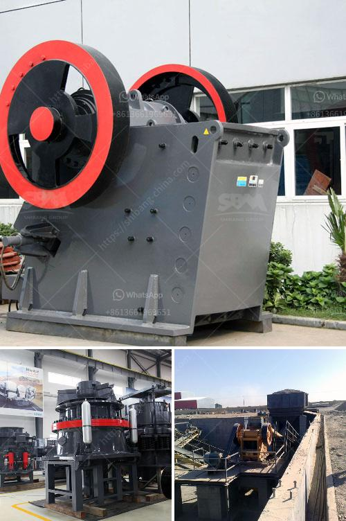

<h3>grinding mill for bentonite</h3>
Bentonite is a mineral rich in montmorillonite clay, often used in drilling fluid and found in abundance in many regions around the world. The resource has been widely recognized for its high adsorption capacity and chemical stability, making it an essential ingredient in various industrial applications. To unlock its full potential, however, a high-performance grinding mill for bentonite is crucial.

Grinding mills, also known as pulverizers or vertical roller mills, are commonly used in the mineral processing industry to grind materials into a fine powder. The use of grinding mills to reduce the particle size of minerals has been widely adopted in recent years, enabling mining companies to increase their production efficiency and control costs.

When it comes to grinding bentonite, choosing the right mill is essential. A high-quality grinding mill not only ensures reliable operation but also contributes to improved performance and efficiency. The ideal mill for bentonite should provide the following advantages:

Firstly, it should have a high grinding efficiency— grinding mills with high efficiency improve the overall productivity of the grinding process and reduce energy consumption. This is achieved by utilizing advanced grinding technology, such as systematic analysis and optimization of the grinding process parameters.

Secondly, the mill should have a consistent product fineness—bentonite is commonly used in the production of drilling muds for oil and gas extraction. For these applications, a consistent particle size distribution is required to ensure optimal performance. A grinding mill with a reliable classification system can achieve this by separating oversized particles and returning them to the grinding chamber for further size reduction.

Thirdly, the mill should have a compact structure and low maintenance requirements. A well-designed mill with robust construction materials ensures durability and minimizes the risk of unexpected downtime. Additionally, mills equipped with advanced control systems can be easily operated and monitored, reducing the need for frequent maintenance and operator intervention.

Finally, environmental considerations should not be overlooked. Modern grinding mills are designed to minimize dust emissions and noise levels, creating a safer and more environmentally friendly working environment for operators.

One example of a grinding mill that meets all these requirements is the Raymond mill. Developed by the Raymond Brothers in the early 20th century, this versatile mill has become the industry standard for grinding various materials, including bentonite. With its advanced technology and reliable performance, the Raymond mill provides an efficient and cost-effective solution for grinding bentonite.

In conclusion, a high-performance grinding mill is crucial for maximizing the potential of bentonite in various industrial applications. It should have high grinding efficiency, consistent product fineness, low maintenance requirements, and environmental friendliness. The Raymond mill is a prime example of such a mill, offering the ideal grinding solution for bentonite and other minerals. By choosing the right mill, businesses can unlock the full potential of this valuable resource and achieve enhanced productivity and profitability.
<h3>Contact us</h3><ul><li><strong>Whatsapp:&nbsp;<a href="https://wa.me/8613661969651">+8613661969651</a></strong></li><li><a href="https://swt.shibang-china.com/?git&amp;zhl&amp;grinding mill for bentonite"><strong>Online Service(chat now)</strong></a></li></ul><h3>Related</h3><ul><li><a href='talc powder making.md'>talc powder making</a></li><li><a href='crushing and screening of manganese ore.md'>crushing and screening of manganese ore</a></li><li><a href='ball mill for lime slaking.md'>ball mill for lime slaking</a></li><li><a href='ball mill instrument equipment.md'>ball mill instrument equipment</a></li><li><a href='marble grinder mill machine.md'>marble grinder mill machine</a></li></ul>