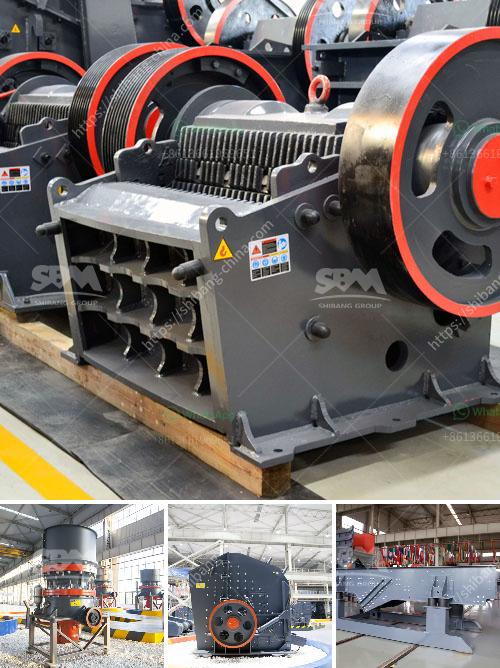

<h3>grinding mill for sale</h3>
A grinding mill is a tool that is designed to break a solid material into smaller pieces. There are many different types of grinding mills and some of them are commonly used in industries like mining, construction, agriculture, and various others. Grinding mills have been developed over the years to cater to the needs of different industries and to improve efficiency and productivity in various processes.

One of the key advantages of a grinding mill is its ability to grind different materials. This versatility makes it a crucial tool for industries that deal with a wide range of materials. For example, in the mining industry, grinding mills are used to grind minerals and ores into smaller particles, which can then be further processed.

Grinding mills also play a vital role in the construction industry. They are used to crush and grind construction materials, such as stones and concrete, into smaller pieces. These smaller pieces are then used in various construction projects, such as roads, buildings, and bridges.

Another industry that heavily relies on grinding mills is agriculture. Grinding mills are used to grind grains and other agricultural products into flour, which is then used to make various food products. Without grinding mills, the process of turning grains into flour would be much more labor-intensive and time-consuming.

In recent years, the demand for grinding mills has been increasing due to the growth of various industries. This has led to a rise in the number of grinding mills available for sale. Whether you are a small-scale business or a large industrial company, finding the right grinding mill for your needs is crucial to ensure smooth and efficient operations.

When looking for a grinding mill for sale, there are several factors to consider. One of the most important factors is the type of material you need to grind. Different materials require different types of grinding mills, so it is important to choose one that is specifically designed for your material.

Another factor to consider is the capacity of the grinding mill. This refers to the amount of material the mill can process in a given period of time. It is important to choose a grinding mill with a capacity that matches your production needs. If the mill is too small, it will result in slower production, while a mill that is too large may be inefficient and costly to operate.

The cost of the grinding mill is another important consideration. Grinding mills come in a wide range of prices, and it is important to choose one that fits within your budget. However, it is also important to remember that quality should not be compromised for the sake of a lower price. Investing in a high-quality grinding mill may initially be more expensive, but it will ultimately result in greater productivity and longevity.

In conclusion, a grinding mill is a crucial piece of equipment for many industries. It plays a vital role in breaking down solid materials into smaller pieces, making them easier to handle and process. When looking for a grinding mill for sale, it is important to consider factors such as the type of material to be ground, the capacity of the mill, and the cost. By choosing the right grinding mill, you can ensure efficient and productive operations for your business.
<h3>Contact us</h3><ul><li><strong>Whatsapp:&nbsp;<a href="https://wa.me/8613661969651">+8613661969651</a></strong></li><li><a href="https://swt.shibang-china.com/?git&amp;zhl&amp;grinding mill for sale"><strong>Online Service(chat now)</strong></a></li></ul><h3>Related</h3><ul><li><a href='coal mining equipment manufacturers in south africa.md'>coal mining equipment manufacturers in south africa</a></li><li><a href='ball mills spain.md'>ball mills spain</a></li><li><a href='process of making silica sand.md'>process of making silica sand</a></li><li><a href='tons per day ball mill.md'>tons per day ball mill</a></li><li><a href='chrome beneficiation plant design.md'>chrome beneficiation plant design</a></li></ul>