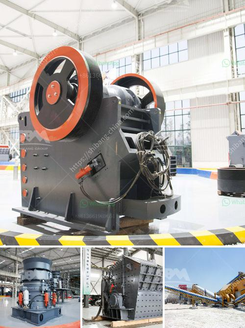

<h3>grinding mill in china</h3>
Grinding mills play a crucial role in the manufacturing and processing of various materials in numerous industries. With the advancement of technology, China has become a significant player in the production of grinding mills. Chinese grinding mills have gained worldwide recognition for their advanced technology, high efficiency, and competitive pricing.

China has a long history of using grinding mills for processing different materials. The earliest grinding mills were stone mortars operated by human or animal power. These primitive tools were used for grinding grains and seeds into flour. Over time, the grinding mills evolved, and the methods of grinding became more sophisticated.

Today, China is a major producer and exporter of grinding mills. Chinese manufacturers offer a wide range of grinding mills for various applications, including mining, construction, and pharmaceutical industries. These mills are designed to process different materials, such as ores, minerals, chemicals, and construction materials.

The quality and efficiency of Chinese grinding mills have significantly improved due to continuous research and development efforts. Chinese manufacturers have invested heavily in advanced technology and innovative design to enhance the performance and reliability of their products. As a result, Chinese grinding mills are now on par with those manufactured by renowned international brands.

One of the key advantages of Chinese grinding mills is their cost-effectiveness. Chinese manufacturers offer grinding mills at competitive prices without compromising on quality. The lower manufacturing costs in China contribute to the affordability of their products. This makes Chinese grinding mills an ideal choice for both domestic and international customers.

China's grinding mills are known for their high efficiency. They are designed to maximize grinding performance while minimizing energy consumption. Chinese manufacturers use cutting-edge technologies, such as advanced grinding media, optimized milling chambers, and efficient motor drives, to ensure excellent grinding efficiency.

In addition to their performance and affordability, Chinese grinding mills are also known for their durability and reliability. Chinese manufacturers adhere to strict quality control measures to ensure that their products meet international standards. Rigorous testing procedures are carried out to guarantee the durability and long service life of their grinding mills.

Furthermore, Chinese manufacturers have an extensive after-sales service network to provide technical support to their customers. They offer timely maintenance and repair services, as well as spare parts supply, to ensure uninterrupted operations of their grinding mills.

As a result of these advancements, Chinese grinding mills have gained widespread popularity and acceptance in the global market. They are exported to various countries, allowing customers worldwide to benefit from their superior grinding technology.

In conclusion, China has emerged as a leading producer of grinding mills due to its advanced technology, cost-effectiveness, and exceptional performance. Chinese manufacturers have made significant investments in research and development to enhance the quality, efficiency, and reliability of their grinding mills. With their competitive pricing and excellent after-sales service, Chinese grinding mills have become the top choice for many industries around the world.
<h3>Contact us</h3><ul><li><strong>Whatsapp:&nbsp;<a href="https://wa.me/8613661969651">+8613661969651</a></strong></li><li><a href="https://swt.shibang-china.com/?git&amp;zhl&amp;grinding mill in china"><strong>Online Service(chat now)</strong></a></li></ul><h3>Related</h3><ul><li><a href='mobile crushing machine sales in south africa.md'>mobile crushing machine sales in south africa</a></li><li><a href='stone crushing sample business plan.md'>stone crushing sample business plan</a></li><li><a href='small ball mill for sale in india.md'>small ball mill for sale in india</a></li><li><a href='3 roller raymond mill.md'>3 roller raymond mill</a></li><li><a href='grinding grinding equipment grinding.md'>grinding grinding equipment grinding</a></li></ul>