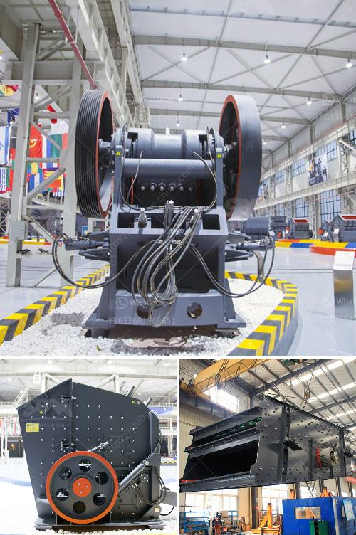

<h3>grinding mill machine in zimbabwe</h3>
Zimbabwe, formerly known as Rhodesia, is a landlocked country located in the southern part of Africa. It is known for its rich history and natural beauty. However, the economy of Zimbabwe has faced significant challenges due to factors such as political instability and hyperinflation. In recent years, there has been a growing need for machinery that can enhance productivity and contribute to economic growth. This is where grinding mill machines play a crucial role.

Grinding mill machines are essential equipment in various industries, such as mining, cement, and agriculture. In Zimbabwe, grinding mills are crucial assets to the mining industry, as they pulverize copper, gold, and other minerals, making them easily extractable. In the farming sector, grinding mills are used to grind maize, wheat, and other crops for animal feed or to produce flour for human consumption.

The grinding mill machine in Zimbabwe utilizes advanced technology to grind different materials. The machine's powerful rollers crush and grind the material into fine powder, which is then collected as the final product. The grinding mill machine's robust design ensures reliability and longevity, making them suitable for use in harsh environments.

The use of grinding mill machines in Zimbabwe has several benefits. Firstly, it increases productivity and efficiency in various industries, contributing to economic growth. Additionally, it reduces labor costs and time required for manual grinding, freeing up manpower for other tasks. Moreover, the machines are versatile and can be used for grinding various materials, offering flexibility and maximizing returns.

However, there are challenges associated with grinding mill machines in Zimbabwe. The initial investment cost can be high, making them inaccessible for small-scale businesses or farmers. Maintenance and repair costs may also pose a challenge, especially in remote areas where skilled technicians are scarce. Nonetheless, these challenges can be overcome through strategic planning, government support, and collaboration with manufacturers and suppliers.

In conclusion, the grinding mill machine in Zimbabwe plays a pivotal role in various industries and contributes to economic growth. Its ability to pulverize minerals and grind crops makes it an indispensable asset. With proper maintenance and support, these machines can continue to enhance productivity and create a brighter future for Zimbabwe.
<h3>Contact us</h3><ul><li><strong>Whatsapp:&nbsp;<a href="https://wa.me/8613661969651">+8613661969651</a></strong></li><li><a href="https://swt.shibang-china.com/?git&amp;zhl&amp;grinding mill machine in zimbabwe"><strong>Online Service(chat now)</strong></a></li></ul><h3>Related</h3><ul><li><a href='impact crushers for sale in usa.md'>impact crushers for sale in usa</a></li><li><a href='used vertical grinder mill for sale.md'>used vertical grinder mill for sale</a></li><li><a href='ball mill cost for 100ton cement plant.md'>ball mill cost for 100ton cement plant</a></li><li><a href='cpc 75 tph stone crusher price in ranchi.md'>cpc 75 tph stone crusher price in ranchi</a></li><li><a href='portable crushing plants for sale.md'>portable crushing plants for sale</a></li></ul>