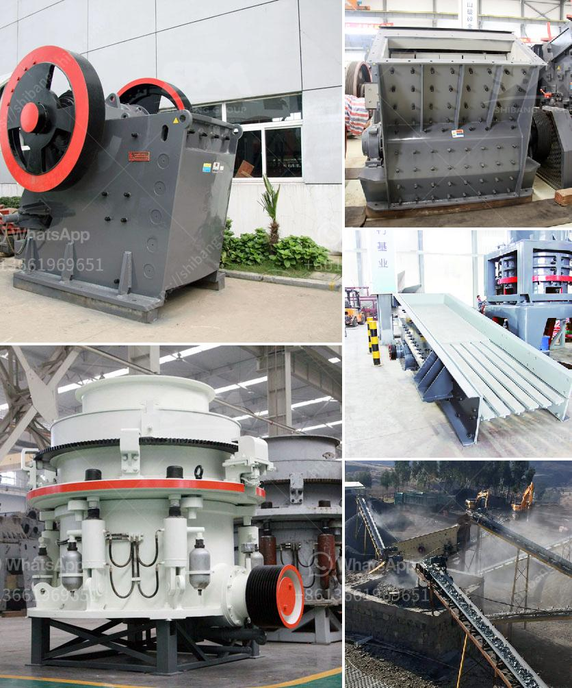

<h3>grinding mill machine price in chennai</h3>
In today's industrial world, grinding machinery is an essential part of most production units. Grinding is a typical and vital part of the manufacturing process. From raw material processing to finished goods production, grinding mills play a crucial role. Grinding mill machines are used for crushing, grinding, and pulverizing materials, hence the name grinding mills. They are commonly used in mining, metallurgy, chemical, pharmaceutical, and construction industries.

When it comes to grinding mill machines, there are several factors to consider, such as the brand, quality, design, and durability of the machine. However, the most important factor to consider is the price of the grinding mill machine. The price of a grinding mill machine determines its affordability and suitability for the specific usage and budgetary constraints of the buyer.

In Chennai, a bustling metropolis in Tamil Nadu, India, grinding mill machines are highly sought after. The city has a thriving industrial sector, and many manufacturing companies rely on grinding mill machines for their production needs. The availability and pricing of grinding mill machines in Chennai are crucial for these companies to ensure smooth and efficient operations.

The price of a grinding mill machine in Chennai typically varies depending on factors such as brand, capacity, type, and additional features. The capacity of a grinding mill machine determines its output and processing capabilities. Higher capacity machines can handle larger quantities of raw materials, resulting in higher production rates. However, higher capacity machines often come with a higher price tag.

Another aspect that affects the price of grinding mill machines is the type of grinding mechanism they employ. Common types include ball mills, hammer mills, and rod mills. Each type has its own specific advantages and applications. For example, ball mills are excellent for grinding hard materials, while hammer mills are more suitable for softer materials. The price of each type of grinding mill machine can vary based on the specific design and construction.

In terms of additional features, grinding mill machines can have various enhancements that increase their usability, efficiency, and safety. These features can include automated controls, advanced safety mechanisms, easy maintenance, and noise reduction. However, these additional features often come at an added cost. Hence, it is essential for buyers to carefully evaluate the necessity and value of these features before making a purchasing decision.

When considering the price of grinding mill machines in Chennai, local market dynamics also play a role. Factors such as supply and demand, competition among suppliers, and import/export regulations can affect the pricing of grinding mill machines in the city. Additionally, customers should also factor in the cost of transportation, installation, and after-sales service when determining the overall price.

To summarize, the price of grinding mill machines in Chennai is a crucial consideration for manufacturing companies in the region. The capacity, type, additional features, and local market dynamics all contribute to the final price. Buyers should carefully evaluate their specific requirements, budget constraints, and long-term goals to make an informed purchasing decision. By doing thorough research and comparing prices from multiple suppliers, companies in Chennai can find the most cost-effective grinding mill machines to meet their production needs.
<h3>Contact us</h3><ul><li><strong>Whatsapp:&nbsp;<a href="https://wa.me/8613661969651">+8613661969651</a></strong></li><li><a href="https://swt.shibang-china.com/?git&amp;zhl&amp;grinding mill machine price in chennai"><strong>Online Service(chat now)</strong></a></li></ul><h3>Related</h3><ul><li><a href='mobile stone crusher price in zimbabwe.md'>mobile stone crusher price in zimbabwe</a></li><li><a href='crusherstone machine in china.md'>crusherstone machine in china</a></li><li><a href='material of conveyor belts.md'>material of conveyor belts</a></li><li><a href='dolomite mining plant price.md'>dolomite mining plant price</a></li><li><a href='conveyor belt manufacturer in saudi arabia.md'>conveyor belt manufacturer in saudi arabia</a></li></ul>