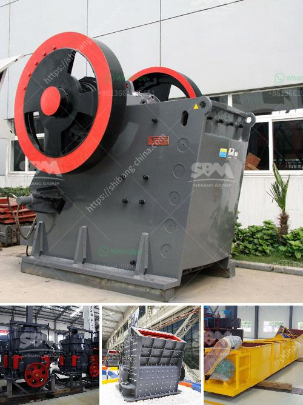

<h3>grinding mill price</h3>
Grinding mills are equipment used to reduce the size of various materials, such as minerals, ores, and rocks. They are commonly used in metallurgy, mining, and various other industries to grind ores and other materials into fine powder. The price of grinding mills varies depending on several factors, such as capacity, brand, and features. In this article, we will discuss the factors that influence grinding mill prices and help you understand the range of prices you can expect for these machines.

One of the primary factors affecting grinding mill prices is capacity. Grinding mills come in different sizes and capacities, ranging from small laboratory mills to large industrial mills. The larger the capacity of the mill, the higher the price. This is because mills with larger capacities require more robust construction, larger motors, and other components to handle the increased workload.

Another significant factor that affects grinding mill prices is the brand. Well-established brands with a reputation for quality and reliability often have higher prices compared to lesser-known brands. This is because reputable brands invest a lot in research and development, ensuring their mills are efficient, durable, and meet the industry standards. However, it is important to note that reputable brands are often worth the investment, as they offer superior performance and longevity.

Features and specifications also play a role in determining grinding mill prices. Different mills come with various features that enhance their functionality and ease of use. For example, some mills have adjustable settings that allow the user to control the desired fineness of the final product. Others may have built-in cooling systems to prevent overheating during prolonged use. Mills with advanced features are generally priced higher due to the extra engineering and technology incorporated into their design.

In addition to capacity, brand, and features, other factors may affect grinding mill prices. These include the cost of raw materials, manufacturing overheads, transportation, and tariffs or taxes imposed by the country of origin. It is crucial to consider these factors when comparing prices from different manufacturers or suppliers to ensure you are getting the best value for your money.

To give you an idea of the grinding mill price range, small laboratory mills typically range from $500 to $2,000, while industrial mills with large capacities can cost anywhere from $10,000 to $100,000 or more. These prices are approximate and will vary depending on the factors mentioned above. It is always recommended to request quotes from different suppliers and manufacturers to compare prices and find the best deal based on your specific requirements.

In conclusion, grinding mill prices are influenced by factors such as capacity, brand, features, and manufacturing costs. The capacity and brand of the mill play a significant role in determining its price, while features and specifications may further impact the cost. Other factors, such as raw material costs, manufacturing overheads, and transportation, also affect prices. By considering these factors and comparing quotes from different suppliers, you can make an informed decision and find a grinding mill that meets your needs and budget.
<h3>Contact us</h3><ul><li><strong>Whatsapp:&nbsp;<a href="https://wa.me/8613661969651">+8613661969651</a></strong></li><li><a href="https://swt.shibang-china.com/?git&amp;zhl&amp;grinding mill price"><strong>Online Service(chat now)</strong></a></li></ul><h3>Related</h3><ul><li><a href='steel casting mining machinery parts wedge plate.md'>steel casting mining machinery parts wedge plate</a></li><li><a href='mobile crusher for.md'>mobile crusher for</a></li><li><a href='dolomite sand composition.md'>dolomite sand composition</a></li><li><a href='grinding ball mill.md'>grinding ball mill</a></li><li><a href='30 tons per hour cost.md'>30 tons per hour cost</a></li></ul>