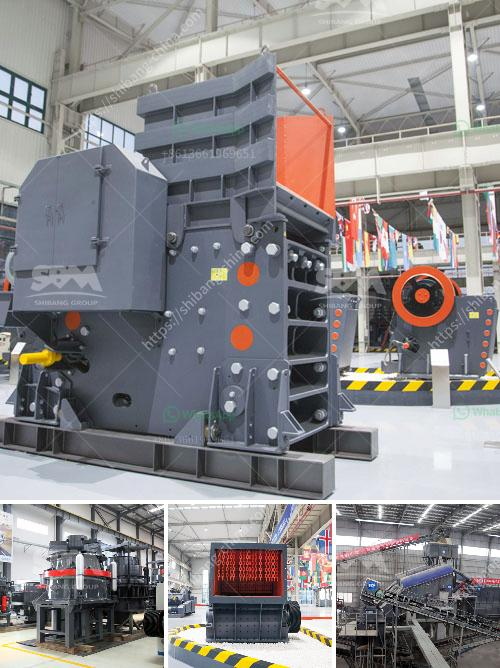

<h3>grinding mills in pakistan</h3>
Grinding mills play an essential role in the mining industry, especially in countries like Pakistan, where many minerals are found. Pakistan has countless reserves of minerals, from coal to gypsum, chromite to limestone, making it a thriving market for grinding mills. These mills are used to pulverize and grind various materials to produce a fine powder, which is used in various industries like cement, construction, ceramics, and more.

One of the primary materials processed by grinding mills in Pakistan is gypsum. Gypsum is a mineral widely used in the construction industry as a building material. By grinding gypsum into a powder, grinding mills allow for its easy mixing with water, thus creating a putty-like material that can be used for plastering walls and ceilings. Gypsum powder is also utilized in making decorative items, such as plaster cornices and moldings.

Another crucial mineral in Pakistan is limestone. Limestone is the basic raw material for producing cement, which is a key component of construction. Grinding mills efficiently pulverize limestone into a fine powder, ensuring that it is finely ground and evenly distributed in the cement mixture. This leads to high-quality and durable construction materials.

Moreover, grinding mills in Pakistan are also used to process minerals like chromite. Chromite is a mineral used in the production of stainless steel and other alloys. By grinding chromite into a fine powder, grinding mills facilitate the extraction of valuable elements for various industrial applications.

In conclusion, grinding mills are invaluable in Pakistan's mining industry. They are crucial for processing and refining minerals like gypsum, limestone, and chromite, turning them into fine powders that are used in construction, manufacturing, and other sectors. Grinding mills enable efficient and sustainable resource utilization, ultimately contributing to the growth and development of Pakistan's industrial sector.
<h3>Contact us</h3><ul><li><strong>Whatsapp:&nbsp;<a href="https://wa.me/8613661969651">+8613661969651</a></strong></li><li><a href="https://swt.shibang-china.com/?git&amp;zhl&amp;grinding mills in pakistan"><strong>Online Service(chat now)</strong></a></li></ul><h3>Related</h3><ul><li><a href='stone crushers made in greece.md'>stone crushers made in greece</a></li><li><a href='used hammer mill crushers.md'>used hammer mill crushers</a></li><li><a href='sewa mobil crusher di kaltim.md'>sewa mobil crusher di kaltim</a></li><li><a href='jaw crusher harga.md'>jaw crusher harga</a></li><li><a href='limestone powder machine in india.md'>limestone powder machine in india</a></li></ul>