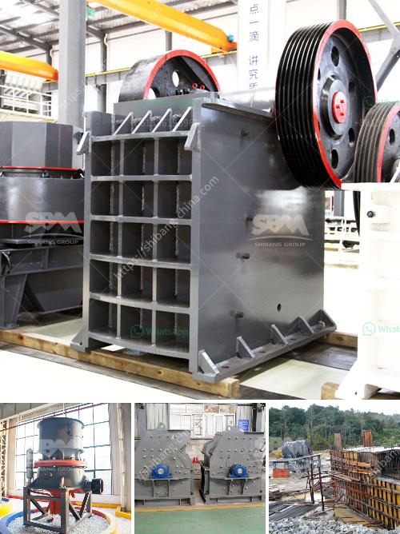

<h3>grinding mills in usa</h3>
Grinding mills in the USA play a crucial role in the manufacturing industry, enabling the efficient processing and production of various materials used in countless products. They are an integral part of the production chain, helping to transform raw materials into finished goods. These mills use a variety of techniques to reduce the size of particles, enhancing their properties and facilitating their use in different applications.

Grinding mills come in various sizes and types, each designed for specific applications and materials. From ball mills and rod mills to semi-autogenous (SAG) mills and high-pressure grinding rolls (HPGR), these machines are critical for industries such as mining, cement, ceramics, and pharmaceuticals, among others.

One of the primary uses of grinding mills is in the mining industry. Mining companies rely on these mills to crush and grind ore into a fine powder, which is then used to extract valuable minerals such as gold, copper, and iron. This process ensures that the minerals are properly sized for further processing and separation.

Cement manufacturing is another industry that heavily relies on grinding mills. These mills are used to grind clinker, a mixture of limestone and clay, to produce cement. The grinding process enhances the reactivity of the materials, improving its final strength and durability. Different types of mills, such as ball mills and vertical roller mills, are used to achieve the desired fineness required for cement production.

The ceramic industry also heavily depends on grinding mills to produce high-quality ceramic materials used in various applications. Ceramic powders undergo grinding to achieve the desired particle size and distribution. This process is crucial to ensure the proper sintering of the materials during the firing process, resulting in ceramics with desired properties such as hardness, strength, and thermal conductivity.

Pharmaceutical companies utilize grinding mills to produce powders with specific particle sizes for various applications. These mills are designed to meet stringent regulatory requirements, ensuring the integrity and safety of the final product. The size reduction process enables better dissolution properties, uniformity, and stability of pharmaceutical substances, enhancing their effectiveness and bioavailability.

Grinding mills in the USA are typically manufactured by a select group of companies with extensive experience and expertise in this field. These manufacturers focus on producing mills that are not only efficient but also reliable and durable, meeting the demanding requirements of various industries. Many of these companies also provide comprehensive after-sales services to ensure the smooth operation and maintenance of the mills.

The grinding mills industry in the USA contributes significantly to the overall manufacturing sector. By providing efficient and precise size reduction solutions, these mills enable industries to produce high-quality products that meet consumer demands. They play a crucial role in transforming raw materials into finished goods, supporting economic growth and innovation.

In conclusion, grinding mills in the USA are essential for various industries, including mining, cement, ceramics, and pharmaceuticals. These mills ensure the proper size reduction of materials, resulting in enhanced properties and improved process efficiency. They are a critical component of the manufacturing industry, contributing to the production of high-quality goods and driving economic growth.
<h3>Contact us</h3><ul><li><strong>Whatsapp:&nbsp;<a href="https://wa.me/8613661969651">+8613661969651</a></strong></li><li><a href="https://swt.shibang-china.com/?git&amp;zhl&amp;grinding mills in usa"><strong>Online Service(chat now)</strong></a></li></ul><h3>Related</h3><ul><li><a href='feldspar stone crushing plant.md'>feldspar stone crushing plant</a></li><li><a href='quarry equipment in kenya.md'>quarry equipment in kenya</a></li><li><a href='netherland ore processing and crusher company.md'>netherland ore processing and crusher company</a></li><li><a href='bentonite processing machinery.md'>bentonite processing machinery</a></li><li><a href='mobile crushing machine sales in south africa.md'>mobile crushing machine sales in south africa</a></li></ul>