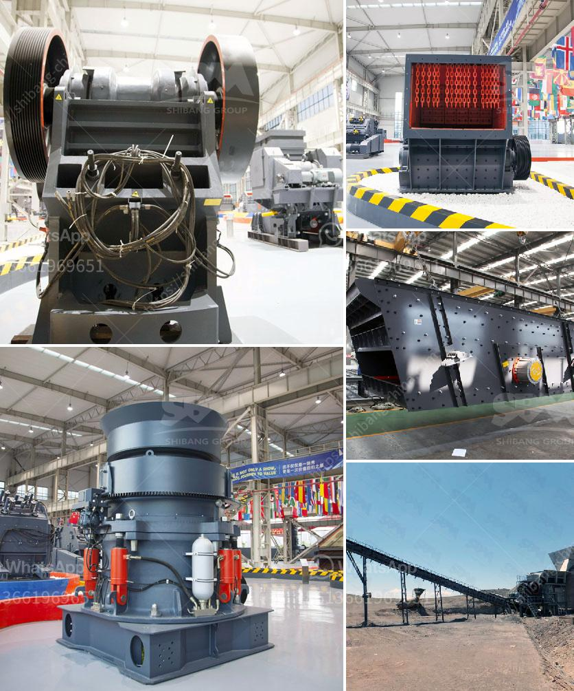

<h3>grinding mills suppliers in china</h3>
China has emerged as a strong player in the global industrial machinery market, including the manufacturing and supply of grinding mills. Grinding mills are crucial industrial tools for grinding various materials into powder. Often used in pharmaceutical, mining, and chemical sectors, these machines are commonly utilized for tasks like blending, crushing, grinding, and mixing.

With the increasing demand for high-quality grinding mills, China has witnessed a rise in the number of suppliers providing various types of grinding mills to cater to diverse industrial requirements. These suppliers have contributed significantly to the growth of the Chinese machinery sector by offering innovative and technologically advanced grinding mills.

China boasts a vast number of grinding mills suppliers, ranging from large-scale manufacturing companies to small and medium-sized enterprises (SMEs). These suppliers are equipped with state-of-the-art production facilities that ensure high precision and efficiency in product manufacturing. Furthermore, they adhere to strict quality control measures, ensuring that the produced grinding mills are reliable, durable, and meet international standards.

One of the key advantages of sourcing grinding mills from China is the significant cost advantage. Due to the country's robust manufacturing capabilities and large-scale production, Chinese suppliers are able to offer competitive prices without compromising on quality. This cost advantage has attracted buyers from around the globe, further enhancing China's position as a major supplier of grinding mills.

Moreover, with the rise in environmental concerns, Chinese grinding mills suppliers have focused on developing eco-friendly solutions. They have increasingly incorporated technologies that reduce energy consumption and minimize pollution. By adopting sustainable practices and improving energy efficiency, these suppliers have gained a competitive edge in the market, attracting environmentally conscious customers.

In addition to their focus on cost and sustainability, Chinese grinding mills suppliers also prioritize customer satisfaction. They offer comprehensive after-sales services, including technical support, spare parts availability, and maintenance assistance. This commitment to customer service has helped build trust and long-term relationships with clients, leading to repeat business and positive word-of-mouth recommendations.

Another significant advantage of choosing Chinese grinding mills suppliers is their ability to customize products according to specific requirements. They offer a wide range of options in terms of design, specifications, and capacities, ensuring that the grinding mills are tailored to fit the unique needs of various industries. This flexibility in customization further distinguishes Chinese suppliers from their competitors.

To maintain their competitiveness, Chinese grinding mills suppliers continuously invest in research and development. They collaborate with universities, research institutes, and other industry players to explore innovative technologies and improve product efficiency. This commitment to innovation enables them to stay ahead in the market and cater to the evolving needs of customers.

In conclusion, the booming industrial machinery market in China has paved the way for a wide range of grinding mills suppliers. These suppliers, equipped with advanced manufacturing capabilities, offer high-quality and customizable grinding mills at competitive prices. By prioritizing customer satisfaction and embracing sustainable practices, they have earned a strong reputation globally. As the demand for grinding mills continues to grow, Chinese suppliers are poised to expand their reach and contribute further to the industry's growth.
<h3>Contact us</h3><ul><li><strong>Whatsapp:&nbsp;<a href="https://wa.me/8613661969651">+8613661969651</a></strong></li><li><a href="https://swt.shibang-china.com/?git&amp;zhl&amp;grinding mills suppliers in china"><strong>Online Service(chat now)</strong></a></li></ul><h3>Related</h3><ul><li><a href='used roller mills for sale.md'>used roller mills for sale</a></li><li><a href='metal pulverizer crusher suppliers.md'>metal pulverizer crusher suppliers</a></li><li><a href='used vertical grinder mill for sale.md'>used vertical grinder mill for sale</a></li><li><a href='process of manufacturing clay products.md'>process of manufacturing clay products</a></li><li><a href='basalt quarry equipments.md'>basalt quarry equipments</a></li></ul>