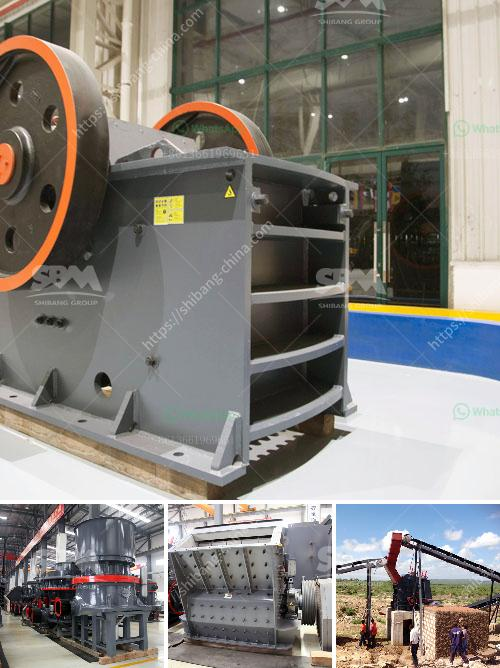

<h3>grinding of ceramic minerals</h3>
Ceramic minerals have gained significant recognition in various industries due to their exceptional properties, including high heat resistance, hardness, and chemical inertness. However, before these minerals can be utilized in their final form, they often undergo a crucial process called grinding. This article will explore the significance of grinding ceramic minerals and its impact on enhancing their material properties.

Grinding is a mechanical process that involves the removal of small particles from the surface of a material using abrasive particles or tools. For ceramic minerals, this process not only refines their surface but also influences their particle size distribution, shape, and overall performance.

One of the primary reasons for grinding ceramic minerals is to reduce their particle size. By reducing the size of the mineral particles, we increase the available surface area, which can enhance their reactivity and sinterability. Smaller particles tend to facilitate better mixing and distribution in ceramic matrices, leading to improved homogeneity and mechanical properties.

Moreover, grinding helps in controlling the particle size distribution of ceramic minerals, which is crucial for many applications. Different size fractions can be obtained through grinding, allowing manufacturers to customize the material according to specific requirements. This control over particle size distribution directly affects the product's properties, such as density, porosity, and mechanical strength.

Grinding also plays a role in shaping ceramic minerals, enabling the production of various forms such as powders, granules, or even specific shapes. The choice of grinding method and equipment can significantly impact the shape and surface characteristics of the final product, making it essential to carefully select the techniques employed.

Furthermore, grinding aids can be used to improve the grinding efficiency and optimize the grinding process. These additives can enhance the lubrication between particles, reduce frictional forces, and prevent agglomeration, resulting in finer and more uniform particles.

In conclusion, grinding of ceramic minerals is a vital step in their processing, enabling the enhancement of their material properties. By reducing particle size, controlling size distribution, and shaping the minerals, grinding plays a crucial role in improving the homogeneity, reactivity, and performance of ceramics. With the use of suitable grinding techniques and additives, manufacturers can achieve optimal results, leading to the production of high-quality ceramic materials for various applications.
<h3>Contact us</h3><ul><li><strong>Whatsapp:&nbsp;<a href="https://wa.me/8613661969651">+8613661969651</a></strong></li><li><a href="https://swt.shibang-china.com/?git&amp;zhl&amp;grinding of ceramic minerals"><strong>Online Service(chat now)</strong></a></li></ul><h3>Related</h3><ul><li><a href='silica sand washing plant china.md'>silica sand washing plant china</a></li><li><a href='pulverizer for ultra fine grinding mill.md'>pulverizer for ultra fine grinding mill</a></li><li><a href='trommel screen suppliers in india.md'>trommel screen suppliers in india</a></li><li><a href='picture of a sand washing plant in uae.md'>picture of a sand washing plant in uae</a></li><li><a href='cost of gold beneficiation plant.md'>cost of gold beneficiation plant</a></li></ul>