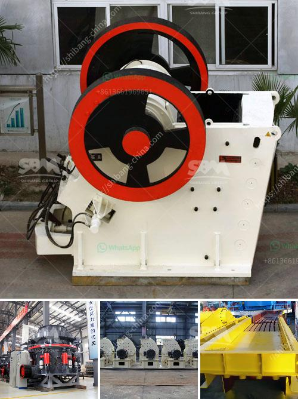

<h3>grinding of limestone crusher</h3>
Limestone, the most common rock in our daily life, is primarily composed of calcium carbonate. Limestone is mainly used as building material, and it is also an important raw material for many industrial applications including cement, lime, and calcium carbide. In order to extract limestone, it is necessary to remove the topsoil and layers of rock known as overburden. Once these layers are removed, the process of extracting the limestone begins. The first step is to crush the limestone into smaller fragments. Then, the crushed limestone is mixed with clay or shale, and then heated and ground in a kiln. This process produces a material known as clinker, which is then ground to a fine powder to produce cement. Among these processes, grinding is an essential step that requires special attention. This article will explain the grinding operation of limestone crusher.

Limestone is a sedimentary rock composed primarily of calcium carbonate in the form of mineral calcite. It most commonly forms in clear, warm, and shallow marine waters. It is usually an organic sedimentary rock that forms from the accumulation of shell, coral, algal, and fecal debris. It can also be a chemical sedimentary rock formed by the precipitation of calcium carbonate from lake or ocean water.

As mentioned earlier, grinding of limestone can be done in various ways. In order to optimize the process, the most effective way is to invest in a limestone crusher. This crusher not only breaks the limestone down, but also captures the impurities present in the crushed limestone. Limestone that is crushed into powdered form is an important part of the cement manufacturing process. This powdered limestone is commonly referred to as limestone dust, and it is used in making cement, roads, and several other industrial applications. By grinding, the limestone particles are reduced in size to create a powder that is then used in various applications.

The grinding process that occurs after the extraction and crushing of the limestone is the most important step in cement production. During this process, limestone particles are ground into a fine powder, creating cement. This powder is then mixed with other ingredients to form concrete, which is used in construction projects, road building, and other applications.

There are two main types of limestone crushers used for this process: jaw crushers and impact crushers. Jaw crushers are commonly used in the primary crushing stage, and impact crushers are used in the secondary and tertiary crushing stages. In the grinding process, the jaw crusher crushes the limestone into smaller sizes. Then, the particles are sent to the impact crusher, where they are ground to a fine powder. The powder is then sent to a classifier, where larger particles are returned to the impact crusher for further grinding.

Grinding of limestone crusher is a necessary and important step in the cement production process. It is the key to achieve the desired quality and consistency of the cement. In the grinding process, different types of grinding machines are used to achieve the desired fineness of the limestone powder. The most common types of crushers used are jaw crushers, impact crushers, cone crushers, and hammer crushers. Each machine has different specifications and can be used in different applications depending on the desired fineness of the limestone powder.

In conclusion, grinding of limestone crusher is an important process that ensures the quality and consistency of the cement. It is an essential step in the cement manufacturing process that helps convert limestone into a fine powder, which is then used in various applications. Without the grinding process, cement production would not be possible. It is crucial to invest in high-quality grinding machines to achieve the desired fineness of the limestone powder.
<h3>Contact us</h3><ul><li><strong>Whatsapp:&nbsp;<a href="https://wa.me/8613661969651">+8613661969651</a></strong></li><li><a href="https://swt.shibang-china.com/?git&amp;zhl&amp;grinding of limestone crusher"><strong>Online Service(chat now)</strong></a></li></ul><h3>Related</h3><ul><li><a href='ballast crusher cost.md'>ballast crusher cost</a></li><li><a href='chrome ore crushers and screeners for hire in south africa.md'>chrome ore crushers and screeners for hire in south africa</a></li><li><a href='jaw crusher quotes.md'>jaw crusher quotes</a></li><li><a href='crusherstone machine in china.md'>crusherstone machine in china</a></li><li><a href='gypsum board manufacturing machine price.md'>gypsum board manufacturing machine price</a></li></ul>