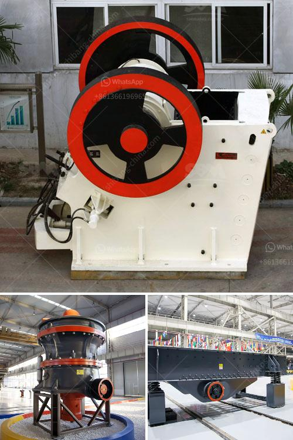

<h3>grinding quartz mesh</h3>
Quartz is a unique and versatile mineral known for its remarkable beauty, durability, and functionality. From countertops to jewelry, the applications of quartz are truly endless. To achieve the desired shape, size, and finish, the process of grinding quartz mesh plays a crucial role. In this article, we explore the importance and benefits of grinding quartz mesh.

Quartz mesh refers to the size of the openings in a mesh screen, usually measured in microns. By grinding quartz into different mesh sizes, manufacturers can create materials that are suitable for a wide range of applications. Whether it's for countertops, flooring, or even electronics, the grinding process helps shape the quartz into fine particles of uniform size, enhancing both its beauty and utility.

One of the key benefits of grinding quartz mesh is that it allows for greater customization and versatility. With different mesh sizes, manufacturers can create a variety of finishes, from coarse to fine, depending on the specific application. For instance, a coarser mesh size is often used for kitchen countertops to create a more textured and natural look, while a finer mesh size is ideal for achieving a smooth and polished finish for jewelry and watches. Grinding quartz into different mesh sizes also facilitates the process of combining quartz with other materials, such as resin or polymers, to create composite materials with enhanced strength and durability.

Another advantage of grinding quartz mesh is its impact on the overall performance and usability of the material. By reducing the size of quartz particles to a desired mesh size, manufacturers can enhance the material's properties, such as its resistance to heat, scratches, and stains. This is especially important in applications where strength and durability are paramount, such as in flooring materials or electronic components. Grinding quartz mesh also helps remove impurities and imperfections, ensuring a more consistent and high-quality final product.

In addition to its aesthetic and functional benefits, grinding quartz mesh also contributes to sustainability and waste reduction. The grinding process allows manufacturers to optimize the use of raw materials by minimizing wastage and ensuring that every particle of quartz is utilized effectively. This not only reduces the cost of production but also promotes responsible resource management. By choosing quartz materials with a specific mesh size, consumers can also contribute to a more sustainable future by selecting products that are tailored to their needs and minimizing waste.

In conclusion, grinding quartz mesh is an essential process that enhances the beauty, functionality, and sustainability of quartz materials. By creating different mesh sizes, manufacturers can customize quartz to meet specific requirements and applications, resulting in materials that offer excellent performance and durability. From kitchen countertops to flooring and electronics, the possibilities of using quartz with the perfect mesh size are endless. As consumers, opting for quartz materials that have been ground to the desired mesh size can not only add value to our lives but also promote responsible resource management.
<h3>Contact us</h3><ul><li><strong>Whatsapp:&nbsp;<a href="https://wa.me/8613661969651">+8613661969651</a></strong></li><li><a href="https://swt.shibang-china.com/?git&amp;zhl&amp;grinding quartz mesh"><strong>Online Service(chat now)</strong></a></li></ul><h3>Related</h3><ul><li><a href='domestic stone crushers.md'>domestic stone crushers</a></li><li><a href='grinding ball mill philippines.md'>grinding ball mill philippines</a></li><li><a href='price of ceramic making machine in india.md'>price of ceramic making machine in india</a></li><li><a href='rent a portable conveyor belt system malaysia.md'>rent a portable conveyor belt system malaysia</a></li><li><a href='calculate crusher wear abrasion.md'>calculate crusher wear abrasion</a></li></ul>