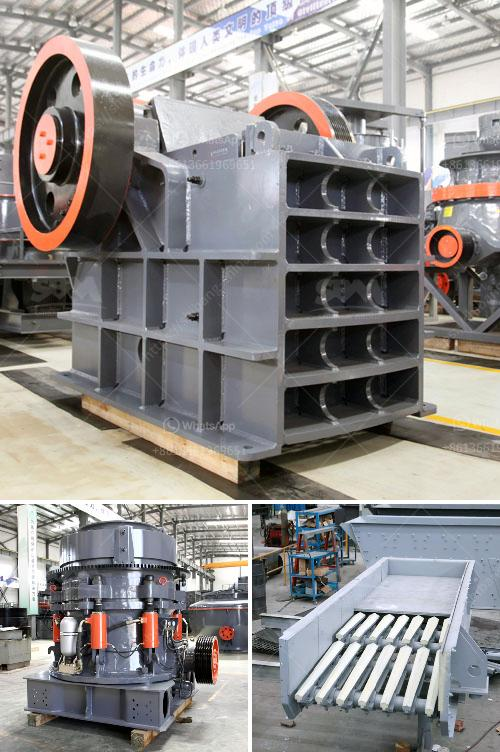

<h3>gypsum board crusher machine</h3>
Gypsum is a popular building material that is widely used in construction projects. However, gypsum can be difficult to crush due to its compact and brittle nature. Fortunately, a gypsum board crusher machine can be utilized to effectively process gypsum materials into a variety of sizes for different applications.

In the gypsum board industry, the crusher machine breaks up large pieces of gypsum materials into smaller particles for further processing. As an efficient and environmentally friendly machine, it aims to reduce gypsum waste and minimize environmental impact.

Gypsum board crusher machines are equipped with various features to provide maximum performance and durability. Some key features may include:

1. High Efficiency: Gypsum crushers are designed to finely crush and break down gypsum materials with high efficiency. This ensures a uniform and consistent final product size.

2. Compact Design: Most crusher machines are designed with a compact structure, taking up minimal space in the production area. This allows for easy installation and integration into existing production lines.

3. Easy Maintenance: Gypsum board crusher machines are designed with easy maintenance in mind. They typically have accessible parts and components, making it easier for operators to perform routine maintenance and minimize downtime.

4. Versatile Applications: Gypsum crushers can process a wide range of materials, including gypsum rock, gypsum powder, and other mineral ores. This versatility makes them ideal for various construction projects.

1. Cost Reduction: By utilizing a gypsum crusher machine, construction companies can save on transportation costs, as the processed gypsum can be used directly onsite, eliminating the need to transport raw materials elsewhere.

2. Environmental Benefits: Gypsum board crusher machines contribute to environmental sustainability by reducing gypsum waste. By crushing and recycling gypsum waste, these machines prevent landfills from being filled with gypsum debris, thus minimizing environmental pollution.

3. Increased Productivity: The use of gypsum board crusher machines allows for faster and more efficient processing of gypsum materials, ultimately improving overall productivity in construction projects.

1. Construction: Gypsum crushers are commonly used to break down and recycle gypsum materials for construction purposes. The crushed gypsum can be used as an additive in cement production or as a soil amendment for agricultural use.

2. Manufacturing: Gypsum crusher machines are also used in the manufacturing industry to produce gypsum board, gypsum plaster, and other gypsum-based products.

In conclusion, a gypsum board crusher machine is a suitable option for crushing gypsum materials, offering numerous benefits to construction companies. With its compact design, high efficiency, and versatile applications, this machine can help reduce waste, lower costs, and contribute to environmental sustainability in construction projects.
<h3>Contact us</h3><ul><li><strong>Whatsapp:&nbsp;<a href="https://wa.me/8613661969651">+8613661969651</a></strong></li><li><a href="https://swt.shibang-china.com/?git&amp;zhl&amp;gypsum board crusher machine"><strong>Online Service(chat now)</strong></a></li></ul><h3>Related</h3><ul><li><a href='cost of crusher machine in ethiopia.md'>cost of crusher machine in ethiopia</a></li><li><a href='mini cement plant grinding project report.md'>mini cement plant grinding project report</a></li><li><a href='lm vertical grinding mill.md'>lm vertical grinding mill</a></li><li><a href='small scale iron ore pallet plant.md'>small scale iron ore pallet plant</a></li><li><a href='vertical mill for sale.md'>vertical mill for sale</a></li></ul>