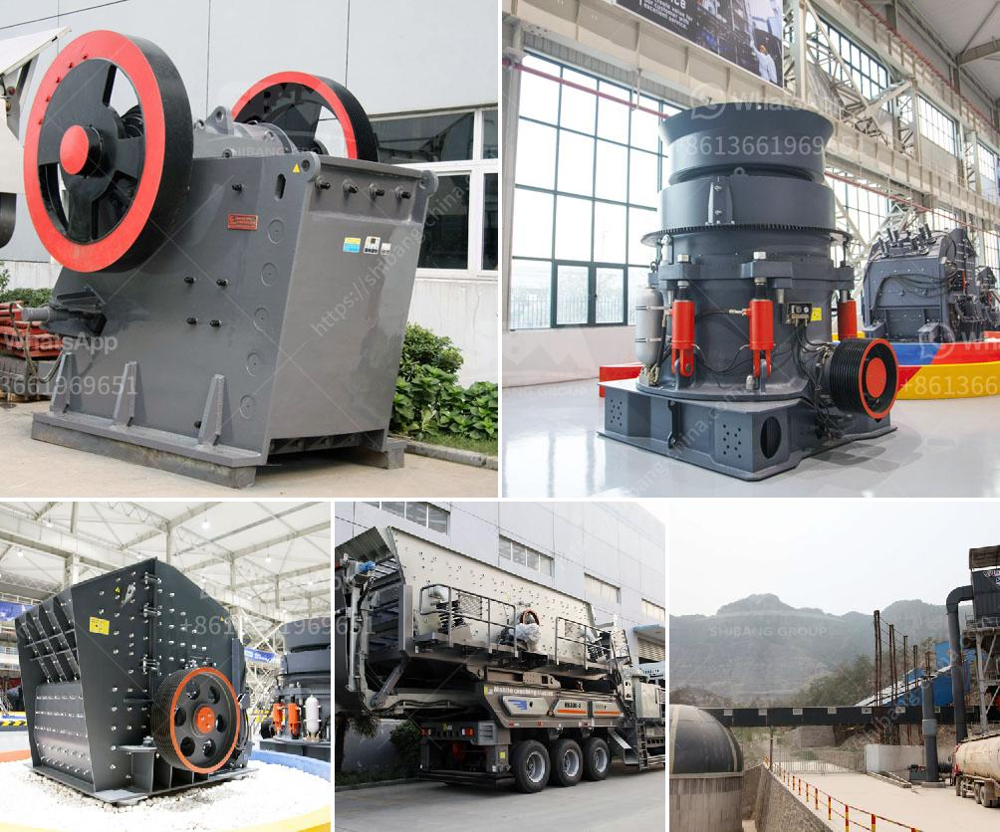

<h3>gypsum board machinery manufacturers india</h3>
Gypsum board, also known as drywall or plasterboard, is widely used in the construction industry for interior walls and ceilings. It offers several advantages such as fire resistance, soundproofing, and durability. To meet the rising demand for gypsum board, manufacturers in India are investing in advanced machinery.

India has seen significant growth in the construction industry in recent years, driven by infrastructure development and urbanization. As a result, there is a growing demand for high-quality gypsum board. To meet this demand, several manufacturers in India are focusing on improving their production processes and machinery.

Gypsum board machinery manufacturers in India are taking advantage of technological advancements to enhance their production capabilities. They are investing in state-of-the-art machinery that can produce gypsum boards efficiently and with improved quality. These machines are capable of producing gypsum boards with precise dimensions, reducing wastage, and optimizing the production process.

Furthermore, gypsum board machinery manufacturers in India are also focusing on sustainable production methods. They are adopting energy-efficient machinery that reduces power consumption and carbon emissions. This not only helps in reducing environmental impact but also lowers the overall production costs.

Some manufacturers in India are also offering customized gypsum board machinery solutions to meet the specific requirements of their clients. This flexibility allows builders and contractors to produce gypsum boards of various sizes, thicknesses, and designs.

In addition to the machinery, manufacturers are also investing in research and development to innovate and improve the quality of gypsum boards. They are constantly working on developing new technologies and techniques to enhance the properties of the boards, such as improved fire resistance and acoustic performance.

Overall, the gypsum board machinery manufacturers in India are playing a crucial role in meeting the growing demand for gypsum boards in the construction industry. Their investments in advanced machinery and sustainable production methods are not only benefiting the industry but also contributing to the country's economic growth. With a focus on quality, efficiency, and sustainability, these manufacturers are positioning India as a leading player in the global gypsum board market.
<h3>Contact us</h3><ul><li><strong>Whatsapp:&nbsp;<a href="https://wa.me/8613661969651">+8613661969651</a></strong></li><li><a href="https://swt.shibang-china.com/?git&amp;zhl&amp;gypsum board machinery manufacturers india"><strong>Online Service(chat now)</strong></a></li></ul><h3>Related</h3><ul><li><a href='jaw crusher machinery.md'>jaw crusher machinery</a></li><li><a href='sand washing machine lsx.md'>sand washing machine lsx</a></li><li><a href='coal mill of cement plant.md'>coal mill of cement plant</a></li><li><a href='movable stone crusher.md'>movable stone crusher</a></li><li><a href='crusher type 600 tph.md'>crusher type 600 tph</a></li></ul>