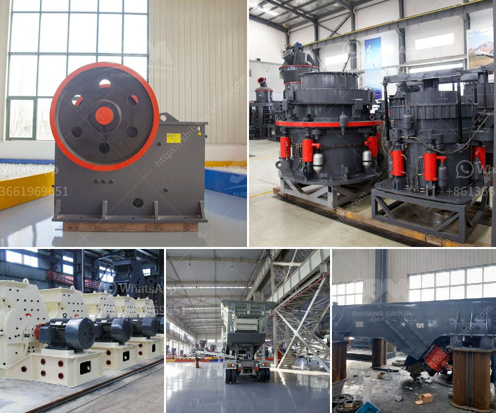

<h3>gypsum board manufacturing equipment</h3>
Gypsum board, also known as drywall or plasterboard, is a common building material used in residential and commercial construction. It is created by sandwiching a core layer of gypsum between two layers of paper, which are then pressed together and dried to form a rigid board. To produce gypsum boards efficiently, specialized manufacturing equipment is required.

The gypsum board manufacturing process starts with the raw material, gypsum, being mined from the earth's surface. Once the gypsum ore is extracted, it is transported to a processing plant where it goes through several stages in order to become a usable product.

Firstly, the gypsum ore is crushed in a crusher and then ground in a mill to produce a fine powder. The powdered gypsum is then mixed with water, additives, and other materials to create a slurry. This slurry is poured onto a moving sheet of paper that is fed into a forming machine.

The forming machine spreads the slurry evenly across the width of the paper, ensuring a uniform thickness. It also shapes the edges of the board and cuts it into the desired length. At this stage, the board is still wet and needs to be dried before it can be further processed.

To dry the gypsum board, it is passed through a series of heated chambers. The hot air inside the chambers removes the moisture from the board, making it hard and rigid. The drying process takes several hours, depending on the thickness of the board and the desired level of dryness.

Once the board is dry, it is trimmed to remove any excess paper or uneven edges. It is then stacked, packaged, and ready for shipment to construction sites or distribution centers.

The equipment used in gypsum board manufacturing is specialized and highly efficient to ensure the production process runs smoothly. Some of the key equipment includes crushers, mills, mixers, forming machines, drying chambers, trimmers, and packaging machines.

Crushers and mills are essential for breaking down and grinding the gypsum ore into a fine powder. Mixers are used to combine the powdered gypsum with water and additives to create the slurry. Forming machines ensure the slurry is evenly spread across the paper and shape the edges of the board. Drying chambers use heat to remove moisture from the board, while trimmers remove any excess paper or uneven edges. Packaging machines are then used to stack and package the finished boards.

Overall, gypsum board manufacturing equipment plays a crucial role in producing high-quality gypsum boards efficiently. The specialized machinery ensures the raw materials are processed correctly and the boards are dried and trimmed to meet industry standards. With the advancement of technology, the equipment used in gypsum board manufacturing continues to evolve, allowing for increased productivity and improved product quality.
<h3>Contact us</h3><ul><li><strong>Whatsapp:&nbsp;<a href="https://wa.me/8613661969651">+8613661969651</a></strong></li><li><a href="https://swt.shibang-china.com/?git&amp;zhl&amp;gypsum board manufacturing equipment"><strong>Online Service(chat now)</strong></a></li></ul><h3>Related</h3><ul><li><a href='rock crusher for sale.md'>rock crusher for sale</a></li><li><a href='200tph cone crusher.md'>200tph cone crusher</a></li><li><a href='stone crusher manufacturer dhaka.md'>stone crusher manufacturer dhaka</a></li><li><a href='feldspar milling market.md'>feldspar milling market</a></li><li><a href='cement crusher in turkey.md'>cement crusher in turkey</a></li></ul>