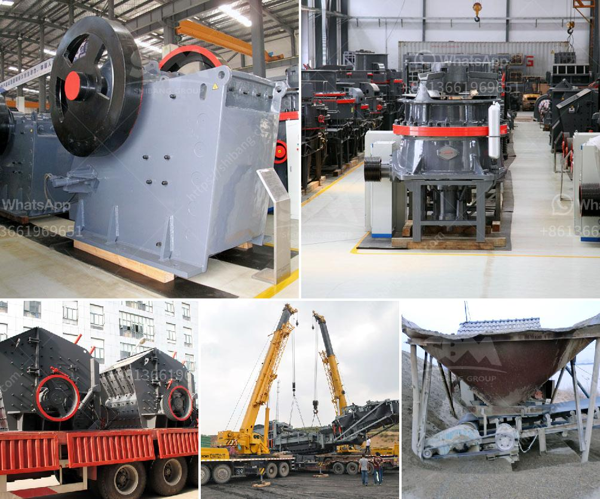

<h3>gypsum board manufacturing machine price</h3>
Gypsum boards, also known as gypsum plasterboards or drywall, are widely used in construction projects due to their excellent fire resistance, thermal insulation, and soundproofing properties. The manufacturing process of gypsum boards involves several steps and requires efficient machinery to ensure high-quality production. In this article, we will delve into the gypsum board manufacturing machine price and explore its various factors.

One of the primary factors determining the price of a gypsum board manufacturing machine is its production capacity. Machines with higher production capacities naturally cost more due to their ability to manufacture a larger number of gypsum boards per unit of time. The price range for gypsum board manufacturing machines can vary significantly, starting from around $100,000 for machines with lower production capacities and going up to $500,000 or more for machines with higher production capacities.

The quality and features of the machine also play a crucial role in determining its price. Gypsum board manufacturing machines with advanced technologies and automation features tend to have higher price tags. These machines may include features like automatic board stacking, precise cutting mechanisms, and efficient raw material feeding systems, all of which contribute to increased productivity and enhanced product quality. Additionally, some machines may offer customization options to produce boards of different sizes or with specific properties, which can also impact the price.

The brand and reputation of the manufacturer are other significant factors that influence the price of gypsum board manufacturing machines. Well-established and reputable manufacturers often offer machines with superior quality, durability, and after-sales support. Consequently, machines from such manufacturers tend to have higher prices compared to those offered by lesser-known or new manufacturers. While opting for machines from renowned manufacturers may come with a higher price, they also provide assurance of reliable performance, spare part availability, and technical support.

Another consideration when evaluating the gypsum board manufacturing machine price is the total cost of ownership. This includes factors such as energy consumption, maintenance requirements, and operational efficiency. Energy-efficient machines may have a higher initial cost but can result in cost savings over the long term. Likewise, machines requiring less frequent maintenance and having minimal downtime can translate into higher productivity and lower overall costs. Therefore, it is essential to consider these factors while assessing the price of a gypsum board manufacturing machine.

Lastly, the market demand for gypsum boards can also impact the price of manufacturing machines. If there is a high demand for gypsum boards and a limited supply of manufacturing machines, the prices tend to be higher. On the other hand, during periods of low demand or oversupply, manufacturers may offer discounts or competitive pricing to attract customers. Therefore, the state of the market should be taken into account when considering the price of a gypsum board manufacturing machine.

In conclusion, the price of gypsum board manufacturing machines varies depending on factors such as production capacity, machine quality, brand reputation, total cost of ownership, and market demand. While higher-priced machines may offer more advanced features and benefits, it is crucial to select a machine that matches the specific requirements, budget, and long-term goals of the business. Proper research, obtaining multiple quotes, and considering the aforementioned factors will help make an informed decision about purchasing a gypsum board manufacturing machine.
<h3>Contact us</h3><ul><li><strong>Whatsapp:&nbsp;<a href="https://wa.me/8613661969651">+8613661969651</a></strong></li><li><a href="https://swt.shibang-china.com/?git&amp;zhl&amp;gypsum board manufacturing machine price"><strong>Online Service(chat now)</strong></a></li></ul><h3>Related</h3><ul><li><a href='usa used equipment grinding mill minerals 3 tph 200 mesh.md'>usa used equipment grinding mill minerals 3 tph 200 mesh</a></li><li><a href='super fine powder mill.md'>super fine powder mill</a></li><li><a href='gypsum production equipments in philippines.md'>gypsum production equipments in philippines</a></li><li><a href='automation conveyor belts.md'>automation conveyor belts</a></li><li><a href='jaw crusher for barite crushing.md'>jaw crusher for barite crushing</a></li></ul>