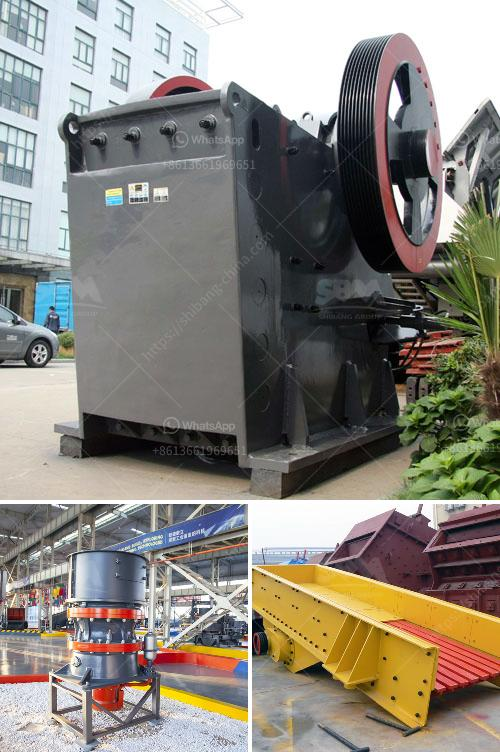

<h3>gypsum crusher price in ethiopia</h3>
Ethiopia is one of the fastest-growing economies in Africa and has been dubbed as the "African Lion" due to its remarkable progress in various sectors. One of the key industries that contribute to the country's economic growth is the mining sector. Ethiopia is rich in various mineral resources, including gypsum, an important raw material for cement and gypsum board manufacturing.

Due to its abundant gypsum reserves, Ethiopia has the potential to become a major player in the global gypsum market. Gypsum is widely used in the construction industry as a binder in cement or as a finishing material for walls and ceilings. As the demand for construction materials continues to rise in Ethiopia, the need for gypsum crushers is also increasing.

Gypsum crusher price in Ethiopia is relatively higher compared to other countries worldwide. Because of the limited extraction of gypsum resources in Ethiopia, gypsum crushers ate in high demand. There is a considerable shortage of the gypsum supply in the country, which increases the price of gypsum crushers in the market.

Another factor that contributes to the high gypsum crusher price in Ethiopia is the cost of transportation. Most of the gypsum reserves are located in remote areas, making the transportation cost of gypsum crushers considerably higher. The infrastructure development in these remote areas is also insufficient, hindering the transportation of gypsum resources and increasing the overall expenses.

Despite the high price, investing in gypsum crushers in Ethiopia can still be a lucrative venture. The growing demand for gypsum in the construction sector ensures a constant market for gypsum crushers. Additionally, Ethiopia's government has been implementing various policies to attract foreign investments in the mining sector, including gypsum mining. With these governmental support and incentives, investing in gypsum crushers can yield profitable returns in the long run.

When considering the purchase of a gypsum crusher in Ethiopia, it is essential to consult with local experts and suppliers to ensure the right selection of equipment. Different crushers have different features and capacities, and it is crucial to choose the appropriate one based on the specific requirements and production needs. Additionally, it is advisable to compare prices and quality from different suppliers to ensure a cost-effective and reliable solution.

In conclusion, gypsum crusher price in Ethiopia is on the higher side due to limited gypsum resources and high transportation costs. However, investing in gypsum crushers can be a profitable venture, considering the growing demand for gypsum in the construction sector and the government's support for the mining industry. Conducting thorough research, consulting local experts, and comparing prices from different suppliers are essential steps to make an informed purchase decision of gypsum crushers in Ethiopia.
<h3>Contact us</h3><ul><li><strong>Whatsapp:&nbsp;<a href="https://wa.me/8613661969651">+8613661969651</a></strong></li><li><a href="https://swt.shibang-china.com/?git&amp;zhl&amp;gypsum crusher price in ethiopia"><strong>Online Service(chat now)</strong></a></li></ul><h3>Related</h3><ul><li><a href='calcite crushing machine.md'>calcite crushing machine</a></li><li><a href='cobble stone machine nigeria.md'>cobble stone machine nigeria</a></li><li><a href='crusher stone plant limpopo.md'>crusher stone plant limpopo</a></li><li><a href='domestic mobile crusher.md'>domestic mobile crusher</a></li><li><a href='silica water washing plant price.md'>silica water washing plant price</a></li></ul>