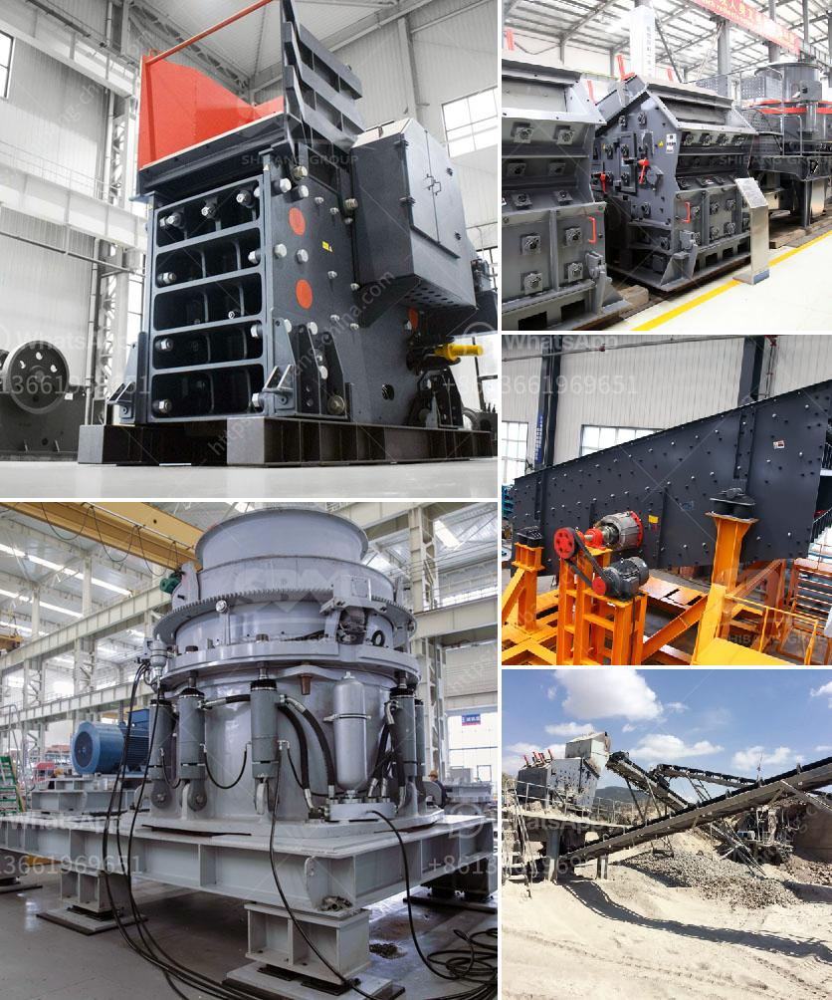

<h3>gypsum grinding machine in india</h3>
Gypsum powder has been widely used in many sectors of the construction industry. Gypsum, also known as calcium sulfate dihydrate, is a mineral that is found in sedimentary rock formations across different countries. The use of gypsum in construction dates back to ancient civilizations, where it was used to enhance the strength and durability of building materials.

In recent years, there has been an increasing demand for gypsum powder in India, driven by the country's booming construction industry. As a result, gypsum grinding machines have gained great importance in India.

To better meet the needs of Indian customers, M&C Machinery, a leading Chinese gypsum grinding machine manufacturer, has developed a high-efficiency gypsum grinding machine in India to meet the diverse needs of customers. It is worth mentioning that not only can it process gypsum, but also other materials such as limestone, calcite, barite, dolomite, marble, etc.

In order to crush gypsum efficiently, it is necessary to choose a suitable crushing equipment. The performance of gypsum powder in construction largely depends on the crushing and grinding equipment. Therefore, when selecting the gypsum grinding machine, the customer should consider the fineness of the finished product, the capacity, the equipment footprint, and the after-sales service of the manufacturer.

M&C Machinery's gypsum grinding machine has the advantages of high efficiency, low energy consumption, high production capacity, and stable operation. The equipment is designed and manufactured according to the production requirements of customers. This machine is equipped with large crushing ratio, high production efficiency, large processing capacity, low energy consumption, and uniform particle size of finished products. It is an ideal equipment for grinding gypsum powder.

Gypsum grinding machines in India can be used to grind a wide range of materials, such as gypsum, limestone, barite, etc. In the cement industry, it is important to choose a suitable grinding machine for gypsum. Pre-grinding mill, MTM grinding mill and MTW grinding mill are the most popular gypsum grinding machines in India.

The pre-grinding mill has a wide range of applications and the final powder is finer. The MTM grinding mill has higher grinding efficiency and is more environmentally friendly. It is an ideal choice for grinding gypsum. The MTW grinding mill is a combination of grinding, drying, classifying and conveying. It has high grinding efficiency and large output, and is the best choice for grinding gypsum powder.

In conclusion, gypsum grinding machines in India can efficiently grind gypsum into powder and promote its application in various industries. With the development of India's construction industry, the demand for gypsum powder increases, and the application of gypsum grinding machine in India will be further expanded.
<h3>Contact us</h3><ul><li><strong>Whatsapp:&nbsp;<a href="https://wa.me/8613661969651">+8613661969651</a></strong></li><li><a href="https://swt.shibang-china.com/?git&amp;zhl&amp;gypsum grinding machine in india"><strong>Online Service(chat now)</strong></a></li></ul><h3>Related</h3><ul><li><a href='vibrating sieve supplier in south africa.md'>vibrating sieve supplier in south africa</a></li><li><a href='jual stone crusher portable.md'>jual stone crusher portable</a></li><li><a href='crusher screener forsale in sweden.md'>crusher screener forsale in sweden</a></li><li><a href='cost of stone crusher in nigeria.md'>cost of stone crusher in nigeria</a></li><li><a href='mobile crusher on rent for iron ore.md'>mobile crusher on rent for iron ore</a></li></ul>