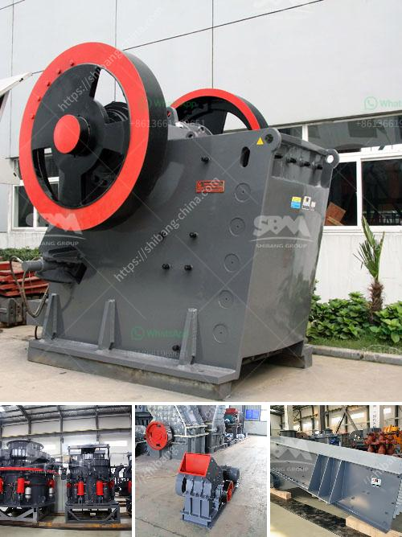

<h3>gypsum mill production</h3>
Gypsum, a mineral often used in manufacturing and construction, is essential for a wide range of industries and applications. One of the crucial steps in the gypsum production process is grinding the mineral into a fine powder. Gypsum mills are the equipment used to grind large chunks of gypsum into small particles for further processing.

Gypsum production involves environmentally sensitive mining practices to minimize impact on surrounding ecosystems. To extract gypsum, miners begin by drilling shafts into the ground near the deposit. Then, explosives are used to break up the gypsum ore, allowing it to be removed by excavators. After the gypsum ore is extracted from the mine, it is transported to a nearby processing facility.

The next step in gypsum mill production is the initial grinding process, known as primary crushing. Large rocks or chunks of gypsum ore are fed into a jaw crusher, which reduces the size of the material to be processed. The crushed gypsum material then travels through various conveyors and screens to remove any impurities or contaminants.

Once the gypsum material has been properly prepared, it is sent to the gypsum mill for fine grinding. The mill, also known as a grinder or pulverizer, grinds the gypsum into a fine powder. This powdered form of gypsum is commonly used in the manufacturing of wallboard, cement, plaster of Paris, and other construction materials.

Gypsum mills vary in design and size, but they typically consist of a rotating grinding chamber with a set of grinding rollers or hammers, which reduce the gypsum particles to the desired size. The ground gypsum powder is then collected in a dust collector or cyclone separator, while the remaining larger particles are fed back into the mill for further grinding.

The efficiency and output of a gypsum mill depend on several factors, including the hardness of the material, the desired fineness, and the moisture content. Some mills may use additional equipment, such as a heated air system, to dry and grind the gypsum simultaneously, ensuring a higher quality end product.

Apart from its use in construction materials, gypsum powder is also utilized in various industries. For example, it is commonly used as an agricultural soil amendment to improve soil texture and fertility. Gypsum can also be found in food products, such as tofu and beer, where it acts as a coagulant or clarifying agent.

In conclusion, gypsum mill production is a crucial step in the gypsum manufacturing process. Through crushing and grinding, large chunks of gypsum are transformed into fine powder, which is used in various industries ranging from construction to agriculture. As technology advances, gypsum mills continue to improve in efficiency and productivity, ensuring a steady supply of this versatile mineral.
<h3>Contact us</h3><ul><li><strong>Whatsapp:&nbsp;<a href="https://wa.me/8613661969651">+8613661969651</a></strong></li><li><a href="https://swt.shibang-china.com/?git&amp;zhl&amp;gypsum mill production"><strong>Online Service(chat now)</strong></a></li></ul><h3>Related</h3><ul><li><a href='stone crushing business plan.md'>stone crushing business plan</a></li><li><a href='germany hammer crusher.md'>germany hammer crusher</a></li><li><a href='price of marble grinder mill.md'>price of marble grinder mill</a></li><li><a href='list of the price of crushing plant turkey.md'>list of the price of crushing plant turkey</a></li><li><a href='hammer mill 150 250.md'>hammer mill 150 250</a></li></ul>