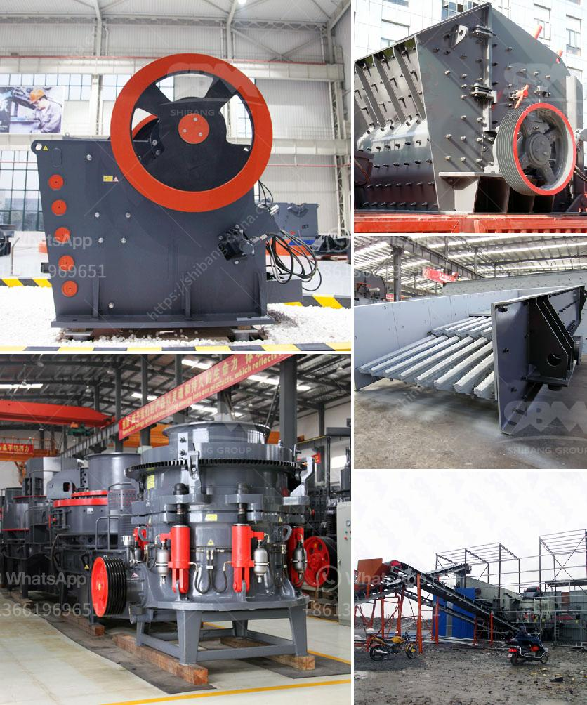

<h3>gypsum powder equipment in turkey</h3>
Gypsum powder equipment is widely used in gypsum powder production lines in Turkey. Gypsum powder is a kind of resource-rich and important industrial raw material, which is widely used in construction, building materials, industrial molds and art models, chemical industry and agriculture, food processing and medical industry, etc. Turkey is one of the important gypsum powder production countries in the world. This article will introduce the current situation of gypsum powder equipment in Turkey.

Turkey has abundant gypsum reserves. According to the statistics of the Turkish Ministry of Energy and Natural Resources, Turkey's proven gypsum reserves rank first in Europe and fourth in the world. Gypsum deposits are mainly distributed in Central Anatolia, southeastern Turkey, and western Mediterranean regions. These areas are where the main gypsum powder production lines in Turkey are concentrated.

The demand for gypsum powder in Turkey is also strong. Gypsum powder is widely used in the construction industry in Turkey. It can be used as a binder for cement and concrete, as well as a leveling agent and filler in interior decoration. The demand for gypsum powder is mainly driven by the construction of new buildings, the renovation and decoration of old buildings, and the upgrading of infrastructure.

In order to meet the growing demand for gypsum powder in Turkey, a large number of gypsum powder equipment has been invested and set up in Turkey. A complete gypsum powder production line in Turkey mainly includes: crushing equipment, grinding equipment, calcining equipment, packaging equipment, and electrical control equipment.

Crushing equipment: The gypsum ores are first crushed into small pieces of less than 30mm by the crusher, and then transported to the mill for grinding.

Grinding equipment: Gypsum powder production line uses advanced processing equipment such as ball mill, roller mill, etc. The gypsum grinding mill machine has the advantages of: compact size, simple structure, high productivity, low energy consumption, stable physical performance, ease of operation and low operating cost.

Calcining equipment: The gypsum powder production line uses heat equipment such as rotary kiln, dryer, etc. The rotary kiln is a cylindrical, refractory-lined vessel, inclined slightly to the horizontal, which is rotated slowly about its axis. The gypsum is calcined at high temperatures in the rotary kiln, resulting in the release of water molecules and the formation of gypsum powder.

Packaging equipment: After the gypsum powder is calcined, it is sent to the packaging system through a conveyor for packaging. The gypsum powder packaging machine is used to automatically package the gypsum powder in bags or barrels, and the packaging is accurate and efficient.

Electrical control equipment: The gypsum powder production line is equipped with electrical control equipment to monitor the entire production process. It is fully automated, saving manpower and improving production efficiency.

In conclusion, gypsum powder equipment in Turkey plays an important role in the production of gypsum powder. With Turkey's abundant gypsum reserves and strong demand for gypsum powder, the establishment of gypsum powder production lines in Turkey can effectively meet the needs of various industries. Furthermore, the continuous improvement and innovation of gypsum powder equipment will further promote the development of Turkey's gypsum powder industry.
<h3>Contact us</h3><ul><li><strong>Whatsapp:&nbsp;<a href="https://wa.me/8613661969651">+8613661969651</a></strong></li><li><a href="https://swt.shibang-china.com/?git&amp;zhl&amp;gypsum powder equipment in turkey"><strong>Online Service(chat now)</strong></a></li></ul><h3>Related</h3><ul><li><a href='coal crusher machine prices in india.md'>coal crusher machine prices in india</a></li><li><a href='clay beneficiation.md'>clay beneficiation</a></li><li><a href='marbel grinding machine.md'>marbel grinding machine</a></li><li><a href='dry grinding ball mill.md'>dry grinding ball mill</a></li><li><a href='pebble crushing plant.md'>pebble crushing plant</a></li></ul>