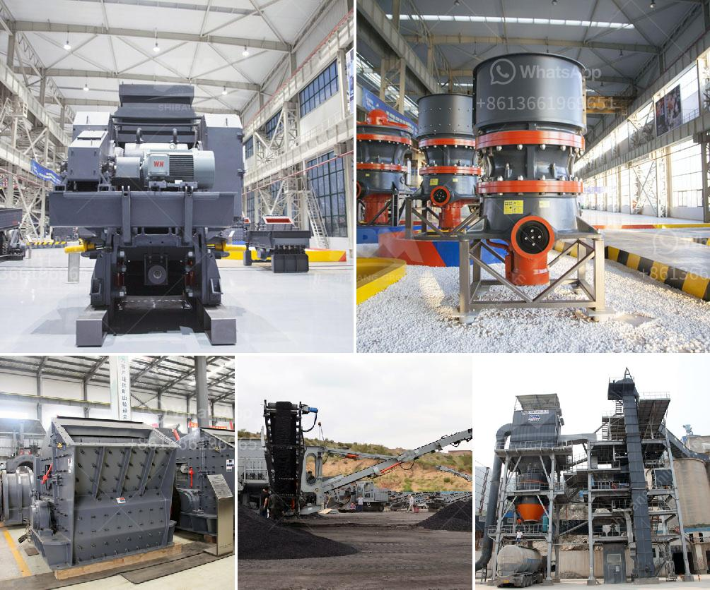

<h3>gypsum powder production plant ppt</h3>
Gypsum powder production plant is a complex process that involves many different components. Gypsum is a mineral rock that is commonly used in various industries, including construction, pottery, and pharmaceuticals. For this reason, it is highly valued as a useful resource and its production requires intricate processing techniques.

One of the main components of gypsum powder production plant is the crusher machine. It is used to crush the raw material into smaller pieces that are suitable for further processing. Gypsum crushing is a vital step in the production process, as the size of gypsum materials directly affects the efficiency of subsequent grinding and overall quality of the final product.

After the crusher machine, the gypsum powder grinding mill is the next component in the production process. It grinds the gypsum materials into fine powder, providing the suitable particle size for further processing. The grinding mill is essential in achieving the desired consistency and texture of the final product.

Another important element in gypsum powder production plant is the kiln. A kiln is a high-temperature furnace that is used to heat the raw gypsum materials and convert them into a specific form called "calcined gypsum." This process involves the removal of water molecules from the gypsum, resulting in a dry and powdered substance that is easier to handle and transport.

In addition to these core components, gypsum powder production plant also requires other auxiliary equipment. This equipment includes conveyors, dust collectors, and storage facilities, which are necessary for the efficient handling and storage of raw materials and final products. These auxiliary components ensure that the production process runs smoothly and that the final product meets the required standards.

The production of gypsum powder also requires adherence to certain environmental regulations. Dust collectors and exhaust systems play a crucial role in maintaining air quality and preventing the release of harmful particles into the environment. Additionally, waste water treatment facilities ensure that any contaminated water is properly processed before being discharged.

In conclusion, gypsum powder production plant is a complex and intricate process that involves various components working together. From crushing and grinding to calcination and storage, every step is vital in achieving a high-quality and consistent final product. Adherence to environmental regulations is also crucial to ensure the sustainability and responsible production of gypsum powder. This versatile material continues to play an essential role in various industries, making the proper management of gypsum powder production plants crucial.
<h3>Contact us</h3><ul><li><strong>Whatsapp:&nbsp;<a href="https://wa.me/8613661969651">+8613661969651</a></strong></li><li><a href="https://swt.shibang-china.com/?git&amp;zhl&amp;gypsum powder production plant ppt"><strong>Online Service(chat now)</strong></a></li></ul><h3>Related</h3><ul><li><a href='grinding mills suppliers in china.md'>grinding mills suppliers in china</a></li><li><a href='quartz mining process.md'>quartz mining process</a></li><li><a href='stone crusher machine price in africa south.md'>stone crusher machine price in africa south</a></li><li><a href='feasiblity study of a fero chrome crushing plant.md'>feasiblity study of a fero chrome crushing plant</a></li><li><a href='gold mining crushing and milling machine.md'>gold mining crushing and milling machine</a></li></ul>