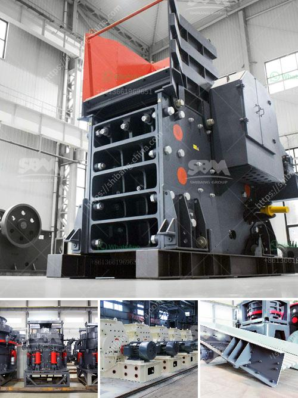

<h3>gypsum powder suppliers in india</h3>
Gypsum is a versatile mineral widely used in various industries such as construction, agriculture, and more. It is a white powdery substance that is derived from the mineral calcium sulfate dihydrate. In India, gypsum powder suppliers play a crucial role in providing the construction industry with the necessary raw materials for the production of gypsum-based products.

India is one of the largest producers of gypsum in the world, making it an ideal location for gypsum powder suppliers. The country has vast gypsum reserves, which are mainly found in Rajasthan, Gujarat, Jammu and Kashmir, Himachal Pradesh, and Tamil Nadu. These regions are known for their quality gypsum deposits, making India a hub for gypsum mining and production.

Gypsum powder suppliers in India offer a wide range of products for various applications. One of the most common uses of gypsum powder is as a binder in the construction industry. It is used in the production of drywall, plaster, and cement. Gypsum-based products are known for their fire-resistant and soundproofing properties, making them popular choices for residential and commercial buildings.

The agricultural sector also extensively uses gypsum powder supplied by Indian suppliers. Gypsum is an excellent source of calcium and sulfur, both of which are essential nutrients for crop growth. It helps improve soil structure, enhances water absorption, and promotes better root development. Farmers use gypsum powder to enhance the fertility and productivity of their land. It is especially beneficial for areas with saline or alkaline soils.

Apart from construction and agriculture, gypsum powder suppliers in India cater to various other industries. Gypsum is used in the production of dental plaster and molds, ceramic molds, art and craft materials, and even in the manufacture of beer and bread. It has numerous applications due to its versatility and unique properties.

When sourcing gypsum powder in India, it is essential to choose reliable and reputable suppliers. Quality control is crucial to ensure that the gypsum powder meets industry standards and specifications. Reputable suppliers invest in modern technology and equipment to process the gypsum and ensure consistency in product quality.

Furthermore, gypsum powder suppliers in India are committed to sustainable mining practices. They adhere to strict environmental regulations and ensure responsible mining activities. This focus on sustainability not only preserves the environment but also improves the quality and purity of the gypsum powder produced.

In conclusion, gypsum powder suppliers in India play a vital role in meeting the demands of various industries. The abundance of gypsum reserves, coupled with the commitment to quality and sustainability, makes India a preferred destination for sourcing gypsum powder. Whether it is for construction, agriculture, or other applications, Indian suppliers offer a reliable source of high-quality gypsum powder.
<h3>Contact us</h3><ul><li><strong>Whatsapp:&nbsp;<a href="https://wa.me/8613661969651">+8613661969651</a></strong></li><li><a href="https://swt.shibang-china.com/?git&amp;zhl&amp;gypsum powder suppliers in india"><strong>Online Service(chat now)</strong></a></li></ul><h3>Related</h3><ul><li><a href='calcite grinding mill.md'>calcite grinding mill</a></li><li><a href='movable stone crusher.md'>movable stone crusher</a></li><li><a href='crushing plant in pakistan.md'>crushing plant in pakistan</a></li><li><a href='grinding mill machine price in chennai.md'>grinding mill machine price in chennai</a></li><li><a href='vsi impact crusher.md'>vsi impact crusher</a></li></ul>