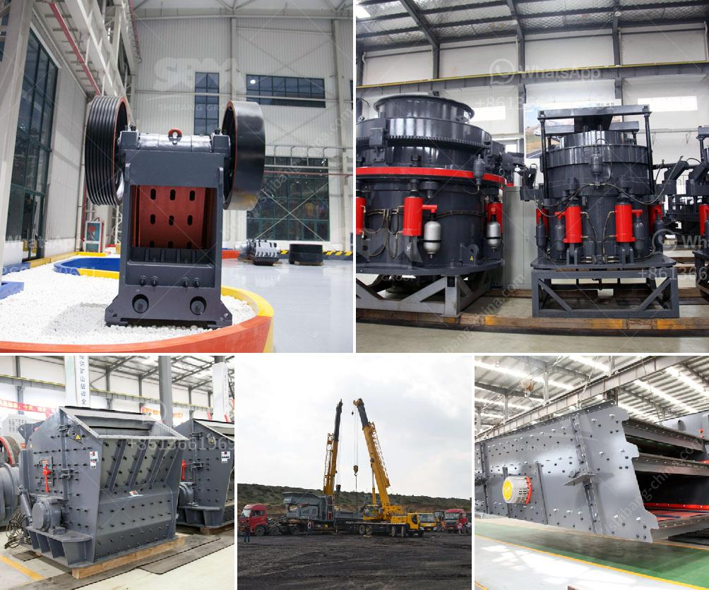

<h3>gypsum processing plant</h3>
Gypsum is widely used in various industries, such as construction, agriculture, and pharmaceuticals, making it a highly valuable mineral. To meet the increasing demand for gypsum, a gypsum processing plant plays a vital role in the processing and production of this versatile mineral.

A gypsum processing plant is designed to process gypsum rock, one of the main raw materials for the production of gypsum-based compounds. Gypsum is commonly used in the construction industry as a plastering material or wallboard. It is a mineral that is non-toxic and poses no danger to human health or the environment.

The process of gypsum processing begins with the extraction of gypsum rock from underground mines or surface quarries. The extracted rock is then crushed into smaller pieces using machinery like a jaw crusher or cone crusher. After crushing, the gypsum rock is transported to a gypsum processing plant for further processing.

At the gypsum processing plant, the crushed gypsum rock is heated to remove any remaining moisture. This is done using a calcination process, where the gypsum rock is heated to a temperature of around 150°C (302°F). During calcination, the water content in the gypsum rock is removed, converting it into a powder form known as plaster or stucco.

Once the gypsum rock has been calcined, the plaster or stucco is further processed to produce gypsum-based compounds. These compounds are used for different applications in various industries. For example, gypsum-based compounds are used as a binder in construction materials like plasterboard, cement, and plaster.

In the production of plasterboard, the plaster or stucco is mixed with water and other additives to form a slurry. This slurry is then poured onto a moving conveyor belt, where it is spread evenly and sandwiched between two layers of paper. The resulting material is then cut into standard-sized plasterboard sheets, which are used for wall and ceiling construction.

Apart from construction, gypsum-based compounds are also used in agriculture to improve soil fertility and water retention. Gypsum can be applied directly to the soil or used to manufacture agricultural gypsum products like fertilizers. These products help enhance soil structure, reduce soil erosion, and promote plant growth.

In the pharmaceutical industry, gypsum is used in the production of medicines and dietary supplements. Gypsum contains essential minerals like calcium and sulfur, which are beneficial for human health. It is often used as an ingredient in antacids, laxatives, and calcium supplements.

As the demand for gypsum continues to rise, the importance of a gypsum processing plant cannot be overstated. These plants efficiently process gypsum rock into various gypsum-based compounds, which are crucial for a wide range of industries. The processing plant ensures the availability of high-quality gypsum products that meet the specific requirements of each industry.

In conclusion, a gypsum processing plant plays a crucial role in the processing and production of gypsum-based compounds. Gypsum, a versatile mineral, is widely used in industries like construction, agriculture, and pharmaceuticals. A well-designed processing plant ensures the availability of high-quality gypsum products for various applications.
<h3>Contact us</h3><ul><li><strong>Whatsapp:&nbsp;<a href="https://wa.me/8613661969651">+8613661969651</a></strong></li><li><a href="https://swt.shibang-china.com/?git&amp;zhl&amp;gypsum processing plant"><strong>Online Service(chat now)</strong></a></li></ul><h3>Related</h3><ul><li><a href='crushing and screening of manganese ore.md'>crushing and screening of manganese ore</a></li><li><a href='iron processing plant manufacturer machine line.md'>iron processing plant manufacturer machine line</a></li><li><a href='simple gold mining machinery with prices.md'>simple gold mining machinery with prices</a></li><li><a href='hydraulic concrete crusher rent mn.md'>hydraulic concrete crusher rent mn</a></li><li><a href='gypsum board crusher machine.md'>gypsum board crusher machine</a></li></ul>