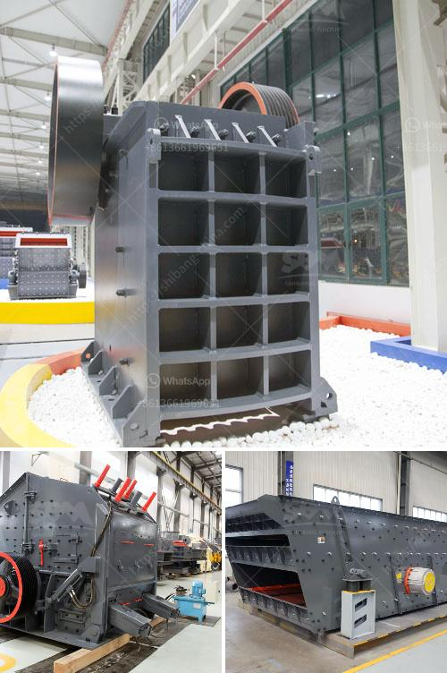

<h3>gypsum production equipments in philippines</h3>
Gypsum is a crystalline mineral found in various natural deposits. It is used in the production of different products that require gypsum as part of their raw material. Gypsum is widely used in industries such as construction, agriculture, and chemical manufacturing. In the Philippines, gypsum mining and processing activities are also contributing to the country's economic growth.

Gypsum or calcium sulfate dihydrate is categorized as a non-metallic mineral. It is commonly used in plastering, blocking, and as a soil conditioner. While gypsum can be found naturally in the country, large-scale production and mining of this mineral is still limited. However, there has been a growing demand for gypsum in the Philippines due to its various applications, leading to increased production efforts.

To meet the rising demand for gypsum, several production equipment manufacturers have invested in the Philippines. These suppliers provide a range of machines such as crushers, mills, and screeners. These mining machines work together to process materials from large chunks to finer powders. They can handle various types of gypsum, including natural gypsum, synthetic gypsum, and recycled gypsum.

Crushers are essential equipment in gypsum production plants, as they reduce the size of the mined gypsum rock into smaller pieces. This process is crucial to ensure an efficient grinding and calcining process later on. Some commonly used crushers include jaw crushers, impact crushers, and cone crushers.

After crushing, the gypsum is further processed using mills. Grinding mills, such as ball mills and Raymond mills, are commonly used in gypsum grinding. These mills can grind the gypsum into particles ranging from 80 mesh to 300 mesh. The finer the particles, the better the gypsum will be as a raw material for various industries.

Another key equipment in gypsum production is the screener. A screener is responsible for separating the crushed gypsum into different particle sizes. This process ensures that the gypsum meets the desired specification for its intended application. Various types of screeners, such as vibrating screens and trommel screens, can be used for this purpose.

Investing in gypsum production equipments in the Philippines brings numerous benefits to the country's economy. Firstly, it creates job opportunities in the mining and manufacturing sectors. The establishment of gypsum production plants provides employment for local communities, contributing to poverty reduction and economic growth.

Secondly, the increased production of gypsum benefits industries that rely on this mineral as a raw material. Construction companies, for instance, can access a stable supply of high-quality gypsum for their projects. Agriculture can also benefit from gypsum production as it is used to improve soil fertility and water retention capacities.

Furthermore, the production of gypsum equipment in the Philippines reduces the need for imports. With domestic production capabilities, the country can reduce reliance on foreign suppliers and strengthen its self-sufficiency in gypsum supply. This contributes to the overall resilience and stability of the country's industries.

In conclusion, the Philippines is experiencing a growing demand for gypsum, leading to increased production efforts. Gypsum production equipments, such as crushers, mills, and screeners, are crucial in processing gypsum into various products. This development brings numerous benefits to the country's economy, creating job opportunities and supporting industries that rely on gypsum as a raw material. As the Philippines continues to invest in gypsum production, it can further enhance its self-sufficiency and contribute to its overall economic growth.
<h3>Contact us</h3><ul><li><strong>Whatsapp:&nbsp;<a href="https://wa.me/8613661969651">+8613661969651</a></strong></li><li><a href="https://swt.shibang-china.com/?git&amp;zhl&amp;gypsum production equipments in philippines"><strong>Online Service(chat now)</strong></a></li></ul><h3>Related</h3><ul><li><a href='machine for gypsum factory from philippines.md'>machine for gypsum factory from philippines</a></li><li><a href='grinding machine for salt in pakistan.md'>grinding machine for salt in pakistan</a></li><li><a href='production process of calcium carbonate.md'>production process of calcium carbonate</a></li><li><a href='hydraulic cone crushers.md'>hydraulic cone crushers</a></li><li><a href='iron mining crusher.md'>iron mining crusher</a></li></ul>