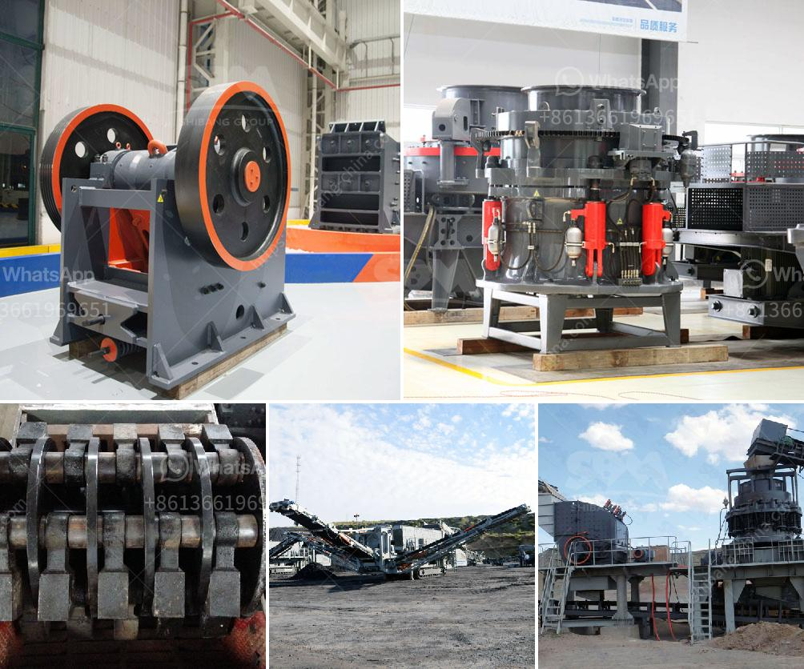

<h3>gyratory cone crusher manufacturers china</h3>
Gyratory cone crushers are one of the most widely used crushing equipment in industries nowadays. They are often used in the mining industry, construction industry, metallurgical industry, chemical industry and quarrying industry. Despite being commonly used, many people do not know much about gyratory cone crushers.

In simple terms, a gyratory cone crusher is a type of secondary crusher that operates in a similar manner to a primary crusher, with less steepness in the crushing chamber and more of a parallel zone between crushing zones. It breaks rock by squeezing the rock between an eccentrically gyrating spindle, which is covered by a wear-resistant mantle, and an enclosing concave hopper.

China, being one of the fastest-growing economies in the world, has been one of the largest producers of mining equipment. Many Chinese manufacturers have developed and produced gyratory cone crushers with the latest technology and modern designs. These manufacturers offer high-quality products to meet the growing demands of the industry.

One of the leading gyratory cone crusher manufacturers in China is Prominer Shanghai Machinery Co., Ltd. With decades of experience in designing and manufacturing gyratory crushers, Prominer Shanghai Machinery Co., Ltd provides a wide range of machinery used for various ore processing operations.

Another well-known manufacturer is CITIC Heavy Industries Co., Ltd. This company is known for its advanced technology and high-quality gyratory cone crushers. With a strong focus on research and development, CITIC Heavy Industries Co., Ltd continuously innovates its products to meet the ever-changing needs of the industry.

Sichuan Mining Machinery (Group) Co., Ltd is also a prominent manufacturer in China. Established in 1958, Sichuan Mining Machinery (Group) Co., Ltd has accumulated rich experience in the manufacturing of mining equipment. Their gyratory cone crushers are known for their excellent performance and durability.

These Chinese manufacturers not only focus on the design and production of gyratory cone crushers but also pay attention to after-sales service. They have established a strong network of service centers and spare parts distributors both domestically and internationally. This ensures that customers can easily access technical support, spare parts, and maintenance services whenever needed.

In addition to providing high-quality products and reliable after-sales support, these Chinese manufacturers also prioritize safety in the design and operation of gyratory cone crushers. They comply with international safety standards and continuously improve their safety features to protect operators and minimize accidents.

As China continues to invest heavily in infrastructure development and the demand for mineral resources remains high, the gyratory cone crusher market in China is expected to grow significantly in the coming years. Chinese manufacturers have positioned themselves well to meet this growing demand by continuously improving their products and services.

In conclusion, Chinese manufacturers of gyratory cone crushers have made significant contributions to the mining industry both in China and internationally. With their advanced technology, high-quality products, and reliable after-sales support, these manufacturers have earned a strong reputation in the market. As the demand for gyratory cone crushers continues to rise, these manufacturers are poised to meet the needs of the industry and contribute to its growth.
<h3>Contact us</h3><ul><li><strong>Whatsapp:&nbsp;<a href="https://wa.me/8613661969651">+8613661969651</a></strong></li><li><a href="https://swt.shibang-china.com/?git&amp;zhl&amp;gyratory cone crusher manufacturers china"><strong>Online Service(chat now)</strong></a></li></ul><h3>Related</h3><ul><li><a href='chrome beneficiation plant design.md'>chrome beneficiation plant design</a></li><li><a href='vertical shaft impact crusher.md'>vertical shaft impact crusher</a></li><li><a href='used portable roller crushers and screens scmmining.md'>used portable roller crushers and screens scmmining</a></li><li><a href='industrial application of pebble mill.md'>industrial application of pebble mill</a></li><li><a href='second hand jaw crusher for sale in harare.md'>second hand jaw crusher for sale in harare</a></li></ul>