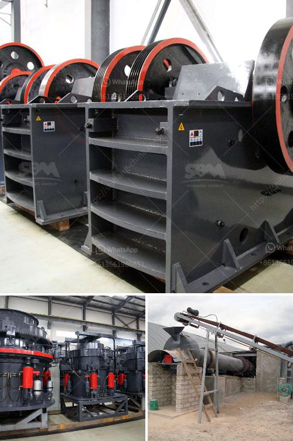

<h3>gyratory crusher hydroset</h3>
A gyratory crusher hydroset, in simple terms, is a device used to adjust the size of crusher settings. It acts as a piston-like device that pushes the main shaft against the adjuster sleeve. Consequently, the crusher settings can be adjusted easily, without any need for additional equipment or personnel.

The hydroset system is an important part of the gyratory crusher, as it determines the discharge size of the crusher. In simple terms, a smaller hydroset size will provide a finer product, while a larger hydroset size will create a coarser product.

The primary purpose of the hydroset system is to ensure consistent product size and maximum crusher input power. It is designed to handle large capacities and heavy loads, making it ideal for mining and aggregate industries.

The gyratory crusher hydroset is typically made of manganese steel, ensuring durability and long service life. It is designed to withstand high pressures and heavy loads without any premature failures.

The hydroset system operates through a hydraulic pump, which creates pressure in the hydraulic cylinder. This pressure pushes the main shaft against the adjuster sleeve, resulting in the desired crusher setting. The operator can easily control the crusher settings through a control panel, ensuring optimal performance and productivity.

Overall, the gyratory crusher hydroset is an essential component of the crusher, providing efficient and reliable control over the discharge size. Its robust design and hydraulic operation make it an indispensable tool in the mining and aggregate industries. Whether it is adjusting the crusher settings or maximizing the crusher's input power, the hydroset system plays a crucial role in ensuring consistent and high-quality final products.
<h3>Contact us</h3><ul><li><strong>Whatsapp:&nbsp;<a href="https://wa.me/8613661969651">+8613661969651</a></strong></li><li><a href="https://swt.shibang-china.com/?git&amp;zhl&amp;gyratory crusher hydroset"><strong>Online Service(chat now)</strong></a></li></ul><h3>Related</h3><ul><li><a href='quartz grinding machine cost.md'>quartz grinding machine cost</a></li><li><a href='conical ball mill manufacturers in india.md'>conical ball mill manufacturers in india</a></li><li><a href='grinding mill for sale.md'>grinding mill for sale</a></li><li><a href='talcum powder supplier for production.md'>talcum powder supplier for production</a></li><li><a href='equipment for gold mining belgium.md'>equipment for gold mining belgium</a></li></ul>