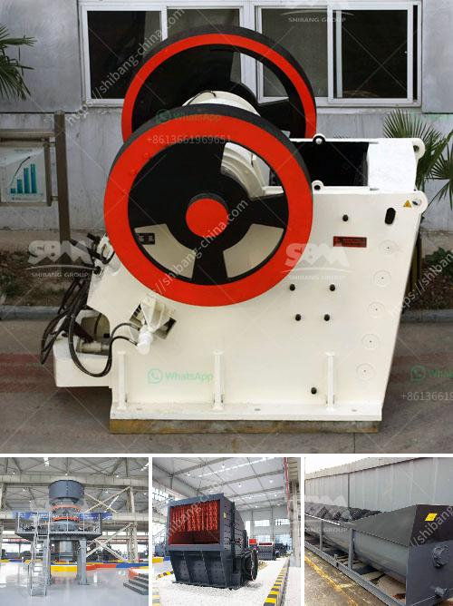

<h3>gyratory gyratory crusher manufacturer in india</h3>
The gyratory crusher is a crushing machine that uses vertical rotation to reduce rocks into smaller pieces. It is ideal for crushing hard and abrasive materials, such as rock, iron ore, and limestone. Gyratory crushers have a conical outer surface and a gyratory head mounted on a spindle. The gyratory motion of the head crushes the stones between the head and concave.

In India, gyratory crushers are well established machines used for crushing applications. They are robustly built with a traditional design that includes efficient crushing chambers and robust wear parts. These crushers have evolved over the years to meet the demands of the modern industry and the increasing need for productivity and efficiency.

One of the leading gyratory crusher manufacturers in India is Shakti Mining. This trusted manufacturer has a wide range of gyratory crushers for sale. The innovative design of Shakti Mining’s crushers allows enhanced performance and reliability. They are equipped with hydraulic adjustment systems, which adjust the CSS (Closed Side Setting) of the crusher to optimize the product size distribution, reduce downtime, and increase productivity.

Shakti Mining offers different models of gyratory crushers, each with unique features. For instance, their SMAN LH Series gyratory crushers come with heavy-duty construction and provide high crushing performance. These crushers are ideal for secondary and tertiary crushing applications. The LH crushers have a hydraulic gap adjustment system to maintain a constant CSS throughout the crushing chamber.

Another notable model offered by Shakti Mining is the SMAN SHCC gyratory hydraulic cone crushers. These crushers feature a unique combination of crusher speed, throw, and cavity design. They provide higher capacity and superior product quality, enabling higher throughput and reduced operating costs.

In addition to Shakti Mining, there are other gyratory crusher manufacturers in India, including Thyssenkrupp Industries India Pvt. Ltd., Metso India Pvt. Ltd., and Propel Industries Private Limited. These companies offer a wide range of gyratory crushers, ensuring there is a crusher to suit every production need.

Gyratory crushers are extensively used in the mining industry for primary crushing purposes. They are also used in aggregate production and construction projects. With the increasing demand for crushed materials, manufacturers in India are developing innovative solutions to enhance the performance of gyratory crushers.

The gyratory crusher manufacturer in India plays a crucial role in the industry's growth trajectory. The high demand for gyratory crushers has propelled manufacturers to adopt advanced technologies to meet the rising demands. These crushers provide efficient crushing solutions with reduced energy consumption and lower operating costs.

In conclusion, the gyratory crusher manufacturer in India offers reliable and efficient machines to meet the crushing needs of various industries. With their robust design and innovative features, these crushers have become a preferred choice for many crushing applications. As the demand for crushed materials continues to grow, gyratory crusher manufacturers in India are committed to providing superior solutions that enhance productivity and reduce downtime.
<h3>Contact us</h3><ul><li><strong>Whatsapp:&nbsp;<a href="https://wa.me/8613661969651">+8613661969651</a></strong></li><li><a href="https://swt.shibang-china.com/?git&amp;zhl&amp;gyratory gyratory crusher manufacturer in india"><strong>Online Service(chat now)</strong></a></li></ul><h3>Related</h3><ul><li><a href='vertical ultra fine pulverizer.md'>vertical ultra fine pulverizer</a></li><li><a href='used portable impact crusher for sale in uae.md'>used portable impact crusher for sale in uae</a></li><li><a href='bauxite processing plant in taitata.md'>bauxite processing plant in taitata</a></li><li><a href='how much does gold mining licences in nigeria.md'>how much does gold mining licences in nigeria</a></li><li><a href='marble crusher price.md'>marble crusher price</a></li></ul>