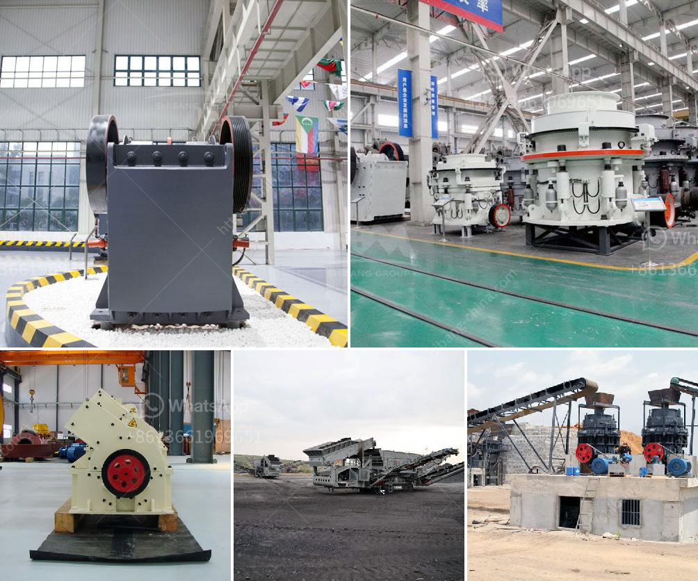

<h3>hammer crusher buhler miag titan</h3>
The hammer crusher Buhler Miag Titan offers the highest quality and performance in its category. With a robust design, it is ideal for crushing soft and medium-hard materials in a wide range of industries including grain, food, and feed. With its advanced technology and innovative features, this crusher guarantees enhanced productivity and efficiency.

One of the key features of the Buhler Miag Titan is its powerful hammer mill system. Equipped with a mighty rotor, this hammer crusher can efficiently crush even the toughest materials. The hammers are designed with an intricate pattern to maximize the impact and reduce wear and tear. This ensures a longer lifespan of the machine and reduces maintenance costs.

Furthermore, the Buhler Miag Titan offers flexibility in terms of the final product size. It allows adjustment of the gap between the hammers and the impact plates, enabling users to achieve the desired particle size. Whether it is for coarse crushing or fine grinding, this versatile crusher can handle it all.

In addition to its performance, the Buhler Miag Titan is known for its user-friendly design. The machine is easy to operate and maintain, making it a reliable and efficient solution for various industries. The access points have been strategically placed to provide quick and convenient maintenance, reducing downtime.

Moreover, the Buhler Miag Titan is equipped with advanced safety features. It is designed to minimize risks and ensure the safety of the operators. The machine is equipped with safety sensors and guards to prevent accidents and injuries, offering peace of mind to the users.

The Buhler Miag Titan offers not only exceptional performance but also high energy efficiency. It is designed to minimize energy consumption without compromising on output requirements. The efficient power transmission system ensures optimum performance while reducing energy costs, making it an environmentally friendly and cost-effective choice.

With its proven track record and superior quality, the Buhler Miag Titan has become a trusted choice for many industries around the world. Its durability and reliability have made it a popular choice in grain processing plants, feed mills, and food production facilities. Its ability to handle a wide range of materials and produce consistent particle sizes has made it a favorite among users.

In conclusion, the Buhler Miag Titan hammer crusher is a reliable and efficient machine that offers outstanding performance and versatility. With its powerful hammer mill system, adjustable gap sizes, user-friendly design, and advanced safety features, it is a top choice for various industries. Moreover, its energy efficiency and low maintenance requirements make it a cost-effective and environmentally friendly solution. Whether it is for crushing grains, food, or feed, the Buhler Miag Titan is a crusher that can be relied upon to deliver superior results.
<h3>Contact us</h3><ul><li><strong>Whatsapp:&nbsp;<a href="https://wa.me/8613661969651">+8613661969651</a></strong></li><li><a href="https://swt.shibang-china.com/?git&amp;zhl&amp;hammer crusher buhler miag titan"><strong>Online Service(chat now)</strong></a></li></ul><h3>Related</h3><ul><li><a href='silica sand machinery manufacture.md'>silica sand machinery manufacture</a></li><li><a href='the process of belt conveyor.md'>the process of belt conveyor</a></li><li><a href='equipment for gold mine tailings in ghana.md'>equipment for gold mine tailings in ghana</a></li><li><a href='chrome ore crushers and screeners for hire in south africa.md'>chrome ore crushers and screeners for hire in south africa</a></li><li><a href='basalt curb stone crusher price.md'>basalt curb stone crusher price</a></li></ul>