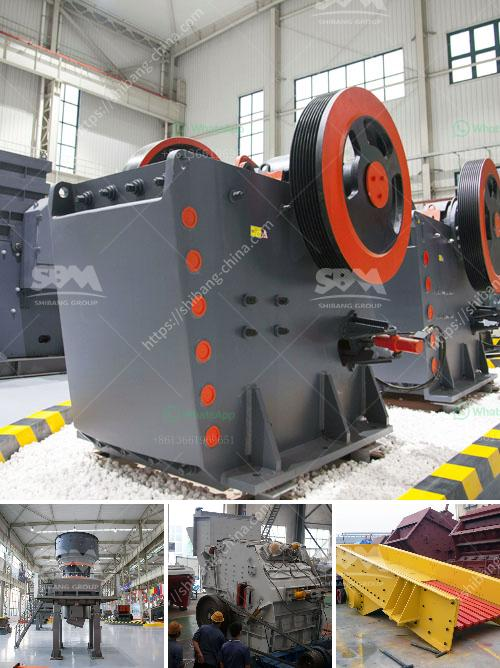

<h3>hammer crusher in japan</h3>
Japan is a country known for its innovation, technology, and efficiency. With its thriving industrial sector, the country has been a pioneer in many fields including machinery and equipment manufacturing. One such equipment that has gained immense popularity in Japan is the hammer crusher.

The hammer crusher, also known as the hammer mill, is a powerful and efficient crushing machine that utilizes high-speed hammering to break down a variety of materials. This crusher offers incredible flexibility, versatility, and efficiency when it comes to crushing and shredding a wide range of materials, including construction debris, wood, rocks, and even concrete.

In Japan, the hammer crusher is widely used due to its unique performance characteristics and innovative features. The hammer crusher can be used for both dry and wet crushing operations, making it an ideal choice for many industries, such as mining, cement, coal, metallurgy, construction material, and road construction.

One of the key advantages of the hammer crusher is its simplicity of design and ease of operation. Unlike other crushers that require complex settings or adjustments, the hammer crusher can be used with minimal effort and training. This simplicity not only saves time and money but also increases overall productivity.

Another advantage of the hammer crusher is its ability to produce a uniform size of output product. This is achieved through the use of specially designed hammers that strike the material in a controlled, precise manner. The impact force delivered by the hammers ensures that the material is efficiently crushed and reduced to a desired size.

Furthermore, the hammer crusher is equipped with a variety of safety features to ensure the protection of operators and prevent accidents. These safety features include a safety pin that prevents the crusher from starting until the pin is properly inserted, as well as a safety shield that protects the operator from flying debris.

The hammer crusher also offers unparalleled durability and reliability. Made from high-quality materials and designed for heavy-duty applications, the crusher can withstand the rigors of continuous operation without any significant wear or damage. This not only ensures consistent performance but also reduces the need for costly repairs and maintenance.

In conclusion, the hammer crusher has become an essential part of the Japanese industrial sector due to its efficiency, versatility, and reliability. This innovative crushing machine offers numerous benefits, such as easy operation, uniform product size, and enhanced safety features. Whether used in mining, construction, or other industries, the hammer crusher continues to play a crucial role in Japan's thriving manufacturing sector.
<h3>Contact us</h3><ul><li><strong>Whatsapp:&nbsp;<a href="https://wa.me/8613661969651">+8613661969651</a></strong></li><li><a href="https://swt.shibang-china.com/?git&amp;zhl&amp;hammer crusher in japan"><strong>Online Service(chat now)</strong></a></li></ul><h3>Related</h3><ul><li><a href='quarry equipment in kenya.md'>quarry equipment in kenya</a></li><li><a href='gravel manufacturing company in thiruvallur district.md'>gravel manufacturing company in thiruvallur district</a></li><li><a href='lime and dolomite plant division.md'>lime and dolomite plant division</a></li><li><a href='bentonite processing plant quotation.md'>bentonite processing plant quotation</a></li><li><a href='sand making plant china.md'>sand making plant china</a></li></ul>