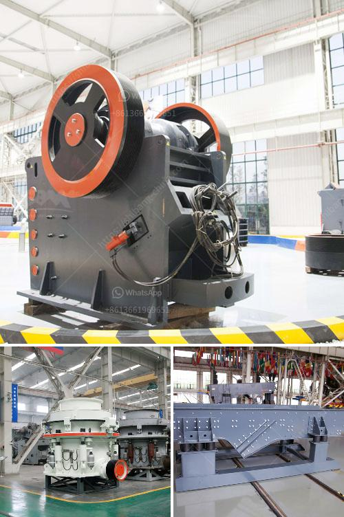

<h3>hammer crusher in power plant</h3>
The hammer crusher, also named hammer mill, crushes materials by the collision between the high-speed hammer and materials. This crusher machine is suitable for crushing raw materials with size less than 150mm and hardness less than 15MPa such as limestone, coke, coal, carbon, and gypsum. The machine has advantages of reliable performance, low energy consumption, low investment, and convenient maintenance.

In a thermal power plant, the main equipment is the crusher which is used to crush the coal into smaller pieces. Although the power generation industry is striving to increase the thermal efficiency of power plants, the formation of coal dust is the unavoidable result of coal combustion. The use of hammer crusher can reduce the coal dust generated during the crushing process and improve the safety of the power plant environment.

The hammer crusher is convenient for fast and easy operation because the equipment can be adjusted according to the specific requirements of the coal-fired power plant. For example, the hammer crusher can be installed at the outlet of the raw coal bunker to crush large pieces of coal into smaller ones. The coal is then transported to the pulverizer mill for grinding before being injected into the furnace.

Additionally, the hammer crusher can be used not only in coal-fired power plants but also in other industries where materials need to be reduced in size for processing purposes. This machine is widely used in cement, chemical, mining, and metallurgical industries.

To summarize, the hammer crusher is indispensable equipment in the thermal power plant. It is a high-efficiency, low-investment, and highly reliable machine that aims to increase the productivity of the power plant while reducing the overall costs associated with coal handling.
<h3>Contact us</h3><ul><li><strong>Whatsapp:&nbsp;<a href="https://wa.me/8613661969651">+8613661969651</a></strong></li><li><a href="https://swt.shibang-china.com/?git&amp;zhl&amp;hammer crusher in power plant"><strong>Online Service(chat now)</strong></a></li></ul><h3>Related</h3><ul><li><a href='mobile aggregate crusher.md'>mobile aggregate crusher</a></li><li><a href='ball mills spain.md'>ball mills spain</a></li><li><a href='law requirements in stone crushing industry.md'>law requirements in stone crushing industry</a></li><li><a href='ball crusher gold machine.md'>ball crusher gold machine</a></li><li><a href='coal pulverizer design.md'>coal pulverizer design</a></li></ul>