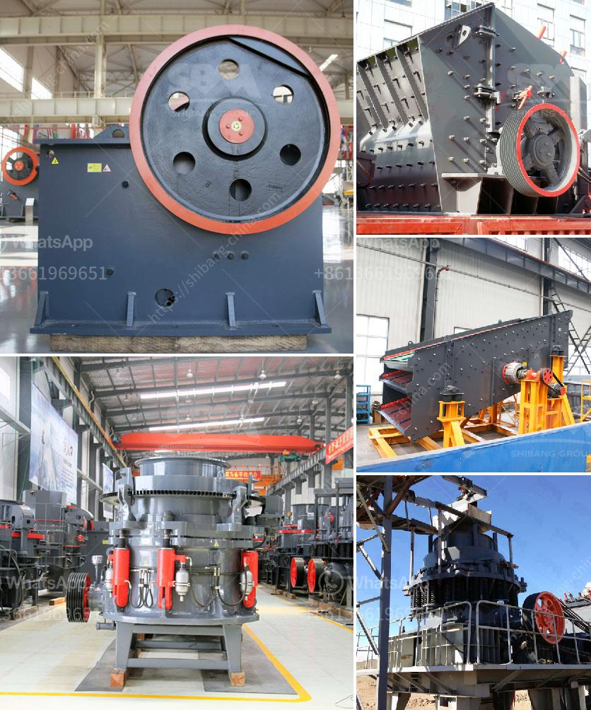

<h3>hammer crusher parts</h3>
Hammer crusher is a crushing machine used for crushing hard and brittle materials. The main working part of hammer crusher is the hammer, which is comprised of spindle, disk, pinshaft and hammers. A hammer crusher works on the principle that basically relies on the usage of installed chassis and high-speed kinetic hammer. The spindle of the machine is lined with a replaceable screen that optimizes the efficiency of size reduction. Hammer crusher parts include the main components, maintenance hammer head, grid plate, pin shaft, hammer, rotor disc and grate.

The majority of hammer crusher parts are cast in grey cast iron. They are ideal for performing tasks that require a tougher metal and a wear-resistant contact surface. The grey iron has excellent castability and the necessary mechanical properties under a high volume production environment. Hammer crusher components and parts are generally robustly designed to withstand very demanding conditions. So, they are used to crush rock, limestone, coal, and other materials, even under the most severe operating conditions.

The hammer crusher parts are available for worldwide customers by virtue of their reliable quality, stable performance and simple operation. The vast majority of customers are fully satisfied with the hammer crusher parts offered by professional supplier. With the aid of advanced technologies, the hammer crusher parts are extremely durable and are known for exceptional performance, enhanced service life, and reduced downtime. They can easily be replaced with great convenience and without affecting the operation of hammer crusher.

To sum up, hammer crusher parts can be used for crushing limestone, coal, and other materials. It is widely used in power industry, coal, chemical processing, metallurgical industry, building materials, and other industries. As long as the equipment is properly maintained and operated, the hammer crusher parts can serve a long-term purpose with minimal downtime.
<h3>Contact us</h3><ul><li><strong>Whatsapp:&nbsp;<a href="https://wa.me/8613661969651">+8613661969651</a></strong></li><li><a href="https://swt.shibang-china.com/?git&amp;zhl&amp;hammer crusher parts"><strong>Online Service(chat now)</strong></a></li></ul><h3>Related</h3><ul><li><a href='domestic stone crushers.md'>domestic stone crushers</a></li><li><a href='small scale gold mining equipment in south africa.md'>small scale gold mining equipment in south africa</a></li><li><a href='cost of setting up mini cement plant.md'>cost of setting up mini cement plant</a></li><li><a href='calcium carbonate crushing machinery.md'>calcium carbonate crushing machinery</a></li><li><a href='silica sand import in europe.md'>silica sand import in europe</a></li></ul>