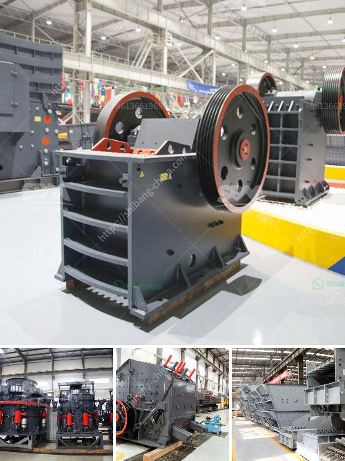

<h3>hammer mill 150 250</h3>
The hammer mill 150 250 is a versatile machine that can be used for different purposes. It is widely used in the agricultural, construction, and industrial sectors for crushing different materials such as grains, corn, wood, and biomass.

One of the key features of the hammer mill 150 250 is its efficiency. It is designed to grind materials into small particles quickly and uniformly. This makes it ideal for applications where a high level of accuracy and consistency is required. The machine's high-speed rotating hammers deliver powerful impacts to the material, reducing it to the desired size.

Another advantage of the hammer mill 150 250 is its simplicity and ease of use. The machine is straightforward to operate, even for beginners. It has a user-friendly interface that allows you to adjust the settings to achieve the desired particle size. Additionally, the compact design of the machine makes it easy to transport and install in different locations.

The hammer mill 150 250 is also highly versatile in terms of customization options. It can be fitted with various screens and hammers, allowing you to customize the machine according to your specific needs. This flexibility makes it suitable for various applications, from small-scale farming operations to large-scale industrial processing.

The machine's durability and robust construction are also worth mentioning. It is built to withstand heavy usage and can handle even the toughest materials. The sturdy design ensures that the machine can operate efficiently for extended periods without experiencing any mechanical failures. This durability translates to reduced maintenance and repair costs, making the hammer mill 150 250 a cost-effective investment.

Moreover, the machine's safety features are an essential aspect to consider. The hammer mill 150 250 is equipped with safety shields and emergency stop buttons, ensuring the operator's safety during operation. The machine also has advanced safety mechanisms that prevent any accidents or injuries.

In summary, the hammer mill 150 250 is a versatile and efficient machine that offers numerous benefits. Its high-speed rotating hammers deliver powerful impacts, reducing materials to the desired size quickly and uniformly. The machine's simplicity, ease of use, and customization options make it suitable for various applications. Its durability, robust construction, and safety features ensure a reliable and safe operation. Whether you are in the agricultural, construction, or industrial sector, the hammer mill 150 250 is a reliable and cost-effective solution for your crushing needs.
<h3>Contact us</h3><ul><li><strong>Whatsapp:&nbsp;<a href="https://wa.me/8613661969651">+8613661969651</a></strong></li><li><a href="https://swt.shibang-china.com/?git&amp;zhl&amp;hammer mill 150 250"><strong>Online Service(chat now)</strong></a></li></ul><h3>Related</h3><ul><li><a href='micronized quartz crusher plant.md'>micronized quartz crusher plant</a></li><li><a href='price jaw crusher 100tph india.md'>price jaw crusher 100tph india</a></li><li><a href='graphite production machinery.md'>graphite production machinery</a></li><li><a href='raymond mill for sale second hand.md'>raymond mill for sale second hand</a></li><li><a href='crusher stone plant limpopo.md'>crusher stone plant limpopo</a></li></ul>