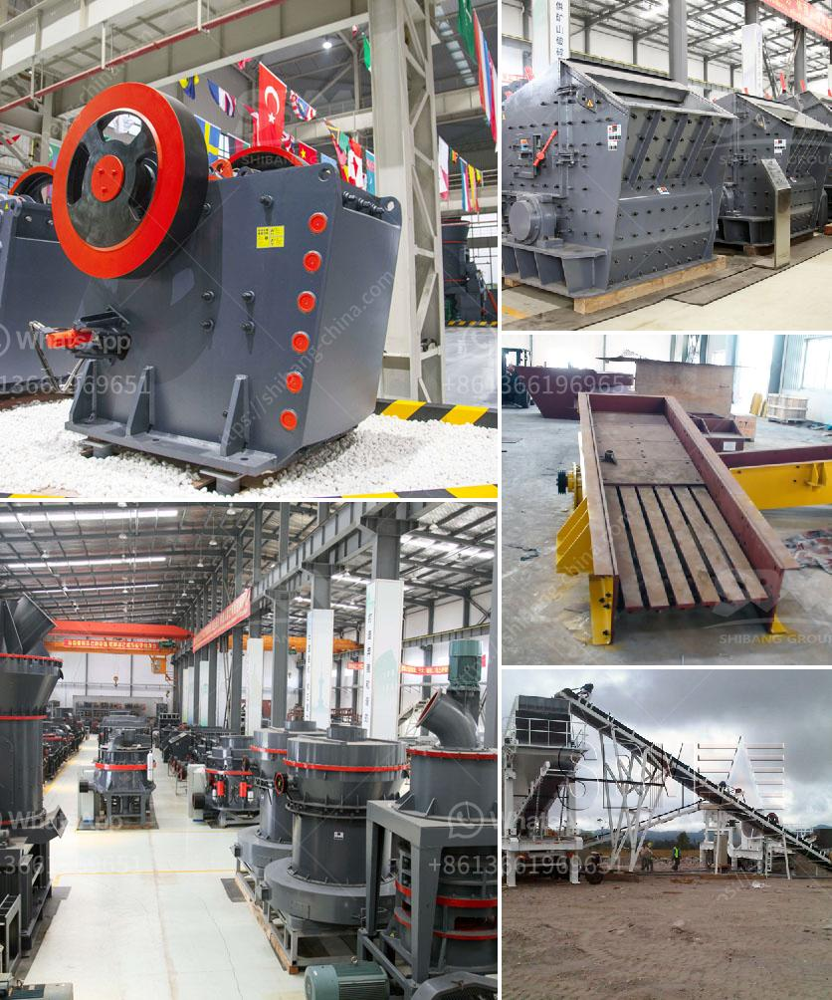

<h3>hammer mill capacity 80 ton per hour</h3>
A hammer mill is a versatile machine that is used to shred material into fine particles. It is commonly used in the agricultural and industrial sectors for various applications ranging from grain grinding to waste management. It can process a wide range of materials, such as grains, straw, corn stalks, bark, and wood chips, into various sizes.

The capacity of a hammer mill is often measured in terms of tons per hour. With a 80 ton per hour capacity, the hammer mill is capable of grinding hard materials into fine particles. It is commonly used in a variety of applications such as wood and waste management, as well as the manufacturing of ethanol and powdered metals.

When it comes to choosing the right hammer mill, it is essential to consider factors such as the material being processed, the particle size required, and the desired capacity. The hammer mill's design also plays a crucial role in determining its efficiency and effectiveness.

Several features contribute to the high capacity of this particular hammer mill. Its robust construction ensures durability and long-lasting performance. The wide feed opening allows for efficient feeding of materials into the mill, increasing the production rate. Additionally, the high-speed rotating hammers deliver a powerful impact on the material, further enhancing the grinding process.

In conclusion, a hammer mill with an 80 ton per hour capacity is suitable for various applications in the agricultural and industrial sectors. Its versatility and ability to process a wide range of materials make it an essential machine in many industries. When choosing a hammer mill, it is important to consider factors such as the desired capacity, the material being processed, and the required particle size. With the right choice, a hammer mill can significantly improve production efficiency and contribute to a more sustainable and profitable operation.
<h3>Contact us</h3><ul><li><strong>Whatsapp:&nbsp;<a href="https://wa.me/8613661969651">+8613661969651</a></strong></li><li><a href="https://swt.shibang-china.com/?git&amp;zhl&amp;hammer mill capacity 80 ton per hour"><strong>Online Service(chat now)</strong></a></li></ul><h3>Related</h3><ul><li><a href='hammer crusher in japan.md'>hammer crusher in japan</a></li><li><a href='marble grinder price in india.md'>marble grinder price in india</a></li><li><a href='price pe 600 900 stone crusher.md'>price pe 600 900 stone crusher</a></li><li><a href='nigeria hammer mill.md'>nigeria hammer mill</a></li><li><a href='used aggregate crushing plant for sale.md'>used aggregate crushing plant for sale</a></li></ul>