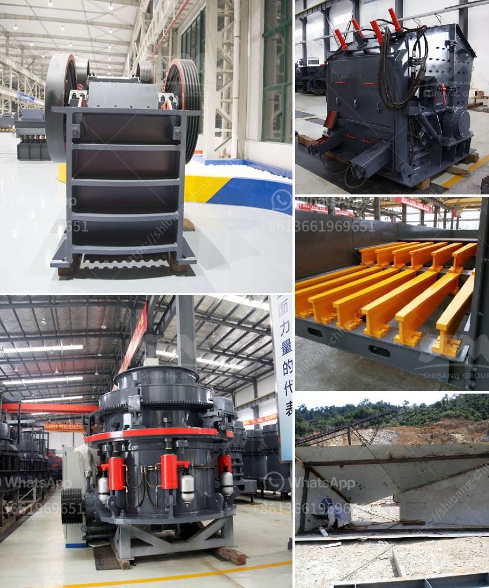

<h3>hammer mill chrome ore china</h3>
Hammer mills are machines that crush and shred metallic and non-metallic materials into smaller pieces. They are used in a variety of industries, including mining, construction, and agriculture. One such material that can be processed using a hammer mill is chrome ore.

Chrome ore is a natural mineral that contains chromium, which is a chemical element. It is typically extracted from the earth in the form of chromite ore, and then processed to produce ferrochrome, which is a high-quality iron-chromium alloy used in various applications.

China is one of the leading producers and exporters of chrome ore globally. The country's extensive chrome ore reserves and advanced mining technologies enable efficient extraction and processing of the mineral. As a result, China is able to supply large quantities of chrome ore to meet the global demand.

Hammer mills in China are commonly used to crush and grind chrome ore into smaller particles for further processing. The machine's high-speed rotating hammers crush the ore against a cylindrical screen or grate, ensuring that the desired particle size is achieved. This process improves the efficiency of subsequent beneficiation processes, such as gravity separation or magnetic separation, as it increases the surface area of the ore particles.

Additionally, hammer mills are versatile machines that can handle other materials besides chrome ore. They can crush a wide range of materials, including minerals, rocks, wood, and agricultural waste. This makes them suitable for various industries, as they can be used to reduce the size of raw materials for further processing or to create powdered or granulated materials.

In conclusion, hammer mills play a vital role in the processing of chrome ore in China. They are essential for breaking down the ore into smaller particles, which can then be efficiently processed to produce high-quality ferrochrome. Moreover, these machines offer versatility, as they can be used for crushing and grinding various materials in different industries. With China's abundant chrome ore reserves and advanced mining technologies, its hammer mills are sure to continue being an important part of the country's chrome ore processing industry.
<h3>Contact us</h3><ul><li><strong>Whatsapp:&nbsp;<a href="https://wa.me/8613661969651">+8613661969651</a></strong></li><li><a href="https://swt.shibang-china.com/?git&amp;zhl&amp;hammer mill chrome ore china"><strong>Online Service(chat now)</strong></a></li></ul><h3>Related</h3><ul><li><a href='list of used machines coal mining.md'>list of used machines coal mining</a></li><li><a href='jaw crusher machine in dubai.md'>jaw crusher machine in dubai</a></li><li><a href='cost of granite crusher.md'>cost of granite crusher</a></li><li><a href='gypsum powder suppliers in india.md'>gypsum powder suppliers in india</a></li><li><a href='mobile crushing plant in peru.md'>mobile crushing plant in peru</a></li></ul>